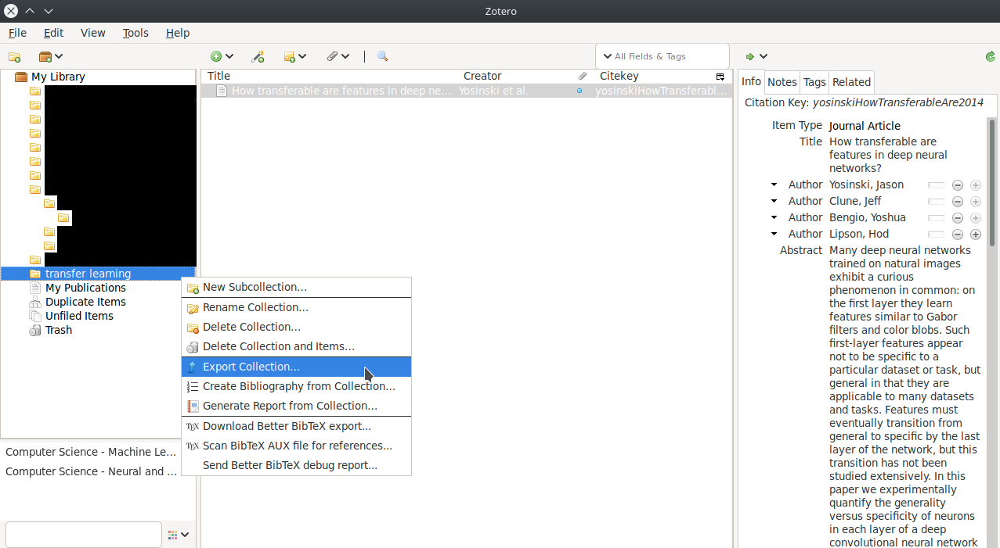

## What is Zotero?

[Zotero](https://www.zotero.org/) is a software that allows you to collect, organize, share and synchronize research papers (or other research contents).
I prefer Zotero to other solutions as it fulfill all my needs, it is open source and "developed by an independent, nonprofit organization that has no financial interest in private information".

## Installation

Zotero is not directly available in default Ubuntu repositories.
I prefer to install it via [Flatpak](https://www.flatpak.org/) as it enables automatic updates like other classic applications in Ubuntu.

First, let's install Flatpak and add [Flathub](https://flathub.org/) repository for Flatpak:

```bash
sudo apt install flatpak
flatpak remote-add --if-not-exists flathub https://flathub.org/repo/flathub.flatpakrepo
```

Now let's install Zotero:

```bash
flatpak install flathub org.zotero.Zotero
```

Zotero is now installed and a shortcut is available in your application menu.

### Extensions

To be able to use all the features presented in this post you also need to install the following extensions:

* The Zotero connector for your web browser.

  To install it, go to the [Chrome](https://chrome.google.com/webstore/detail/ekhagklcjbdpajgpjgmbionohlpdbjgc) (compatible with chromium-based browsers) or the [Firefox](https://www.zotero.org/download/connectors) add-on page.

* Zotero software can add extensions, in my daily use I only use one: Better BibTeX.

  To install it:
  1. Download the [latest xpi file](https://github.com/retorquere/zotero-better-bibtex/releases/latest).
  2. Open Zotero, go to `Tools` -> `Add-ons`, click on the gear -> `Install Add-on From File...` and select your previously downloaded extension.

## Add papers to your collections

First, I recommend you to create an online account on the Zotero website.
It will help you to synchronize your library for all your devices (in my case at home and at work).
To sign in the Zotero application, go under `Edit` -> `Preferences` -> `Sync` tab.

Now you can use your browser to look into papers on the web (in [arXiv](https://arxiv.org/) for example).
When you want to add a paper to your collection, just click on the Zotero connector button in your web browser while you are looking into the PDF of the desired paper.
It will automatically download the paper for offline use and extract all the information required to cite this paper (such as Title, Authors, Date and so on).
If any uploaded information looks wrong, you can modify it at any time.

## Generate your BibTeX file using Zotero

Before generating your BibTeX file, you may want to personalize the citation key format you will use in your TeX file.
To do so, go to the Better BibTeX menu: Edit -> Preferences -> Better BibTeX tab.
I use the default citation key format which please me: `[auth:lower][shorttitle3_3][year]`
It corresponds to the first author (in lower cases), followed by the title of the paper (truncated) and the year of publication.
If you want to modify the format of the generated keys, have a look to the official documentation [here](https://retorque.re/zotero-better-bibtex/citing/).

After doing this, don't forget to refresh the citation key for every item in your collection (it is not automatic, but Ctrl+A key combination is your ally). Even if you want to keep the default citation key format from Better BibTeX extension, you have to do it. At least once after installing better BibTeX extension, unless Zotero keeps its default key format which uses underscores (which is better to avoid if you use LaTeX).

<figure markdown="span">
  
</figure>

To generate the BibTeX file:

1. Right-click on the collection (or library) containing all the papers you want for your Bib file then click on `Export Collection`, just as follows:

    <figure markdown="span">
      
    </figure>

2. In the contextual menu, select "Better BibTeX" format (which use a cleaner format compared to the default BibTeX format of Zotero) and check the "Keep updated" box to let Zotero update your bib file when you add/modify your Library.
    <figure markdown="span">
      
    </figure>

You have now a bib file usable for your paper with your citation key format.

Hope it helps some of you.

See you again, Vincent.
