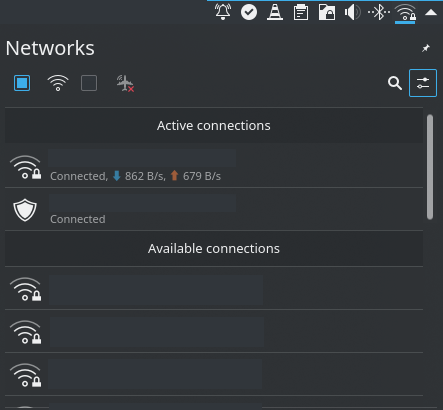
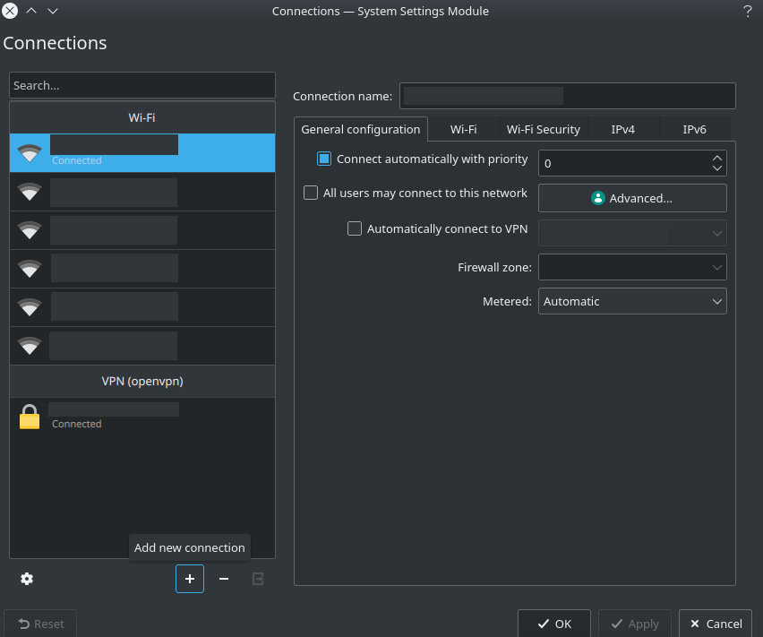
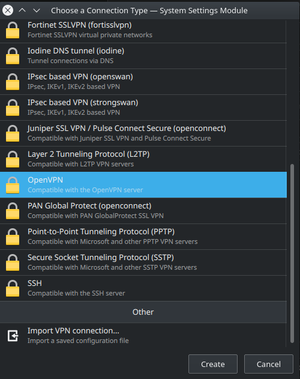

This post represents all configurations that I have done to work at home.
It is especially useful when you are under quarantine (or will be as the COVID-19 progress are alarming).
I will describe all steps for Ubuntu users that use KDE environment, but it is similar for GNOME users and some steps are identical.

## Connect your personal computer to the VPN of your company/lab using OpenVPN

It is the first step required if you want to access to the intranet of your company/lab.
Mine support OpenVPN, so I will describe the steps required to use it.

First, install OpenVPN:

```bash
sudo apt install openvpn
```

Then install the connector for your personal environment.

```bash
# for KDE users
sudo apt install network-manager-openvpn
# for GNOME users
sudo apt install network-manager-openvpn-gnome
```

Then you can use the graphical interface of your environment to connect to your desired VPN.
For KDE users, go to the Network widget:

<figure markdown="span">
    
</figure>

Then click on the "Configure network connections..." icon (surrounded with blue on the previous image).
It opens you the following system settings module:

<figure markdown="span">
    
</figure>

To add a VPN connection, click on the "Add new connection" icon.
Then it opens you this menu:

<figure markdown="span">
    
</figure>

Here click on OpenVPN, then click on "Create" and follow the instruction of your company/lab.
If your company/lab provide an OpenVPN file it is easier, just click on "Import VPN connection..." and select the provided file.

## Connect to distant servers

I use ssh connections to access to the machines I use at work using my local terminal.
To recall this is how you can connect to distant server using ssh:

```bash
ssh <login>@<server_address> -p <port number>
```

If you want to create a ssh server or having more details, I advise you to look at the [official Ubuntu documentation](https://help.ubuntu.com/lts/serverguide/openssh-server.html).

Just after being connected, I always start/attach a tmux session.
If you don't know what is tmux, have a look at my post [here](../2019/09-23-terminal-multiplexers.md) for more details.
To automatize this behavior, I add the following code to my `~/.bashrc` file on the server side:

```bash
# automatically open tmux when using ssh connection without X server
if [ ! -z "$SSH_CLIENT" ] && [ -z "$DESKTOP_SESSION" -a -z "$TMUX" ] ; then
    tmux attach -t "ssh" 2> /dev/null || tmux new -s "ssh"
fi
```

Now every time I use ssh to connect to servers from work, it starts or attach to a tmux session called "ssh".

## Working with Jupyter Lab Notebooks

If you use Jupyter Lab, you may want to use your local browser to access to your notebooks.
There is many solutions on the Internet to do this.
Here is my solution:

1. Create a password for jupyter notebooks (server side):

    ```bash
    jupyter notebook password
    ```

2. Launch jupyter lab using a specified port (here 8887):

    ```bash
    jupyter lab --port=8887 --no-browser
    ```

3. On your local terminal forward the 8887 port of the server to, let say the 8888 port of your local machine using ssh tunneling:

    ```bash
    ssh -N -f -L 8888:localhost:8887 <login>@<server_address>
    ```

4. Use your local browser and go to [localhost:8888/](localhost:8888/) and enter the password entered in step 1.

5. Enjoy

When you have finished, you maybe want to unset the forwarding port on your local machine.
To do so, identify the PID of the command used in step 3 using the following command:

```bash
ps -ax | grep "ssh -N -f -L"
```

Once you identify the PID use the kill command to stop the forwarding port:

```bash
kill -9 <PID_identified>
```

Hope it helps some of you.

Cheers, Vincent
