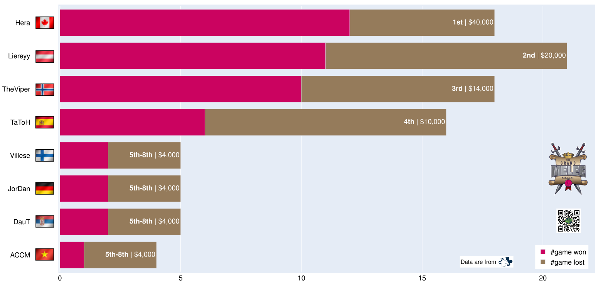
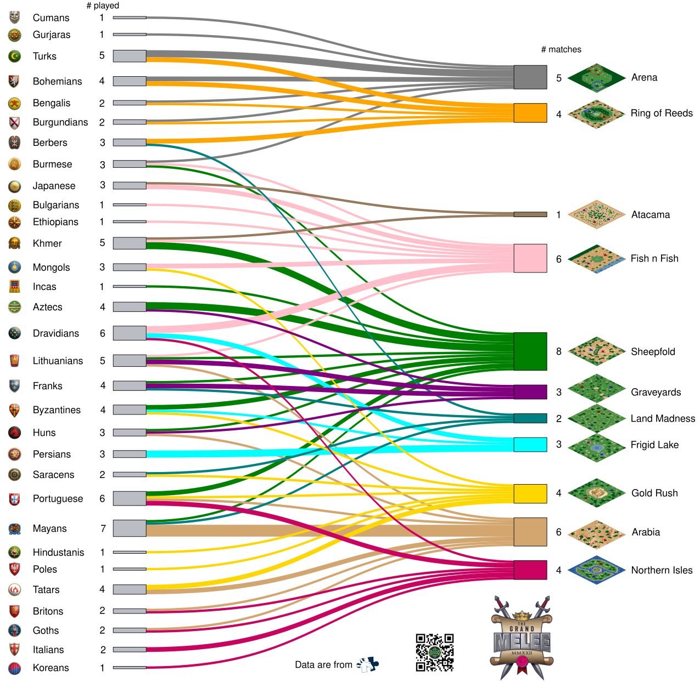
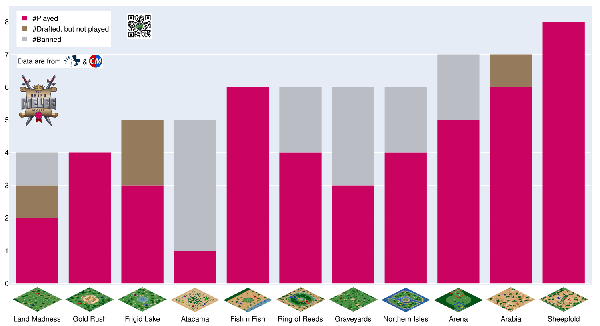
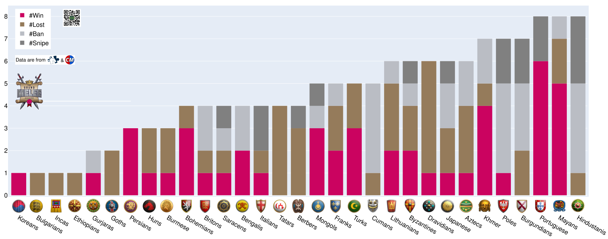

This post is the third episode in my Age of Empires 2 tournament series (check out [my first](../2022/12-08-redbull-wololo-legacy.md) and [my second](../2022/12-13-warlords.md) if you missed them).
All the work done here is about the main event (that's what interests me the most in tournaments).
As a reminder, I published most of these visualizations on [Reddit](https://www.reddit.com/user/vroger11) before making this post. This one is a summary of the tournament and the feedback I got.

This time, I improved my visualizations with additional data from [Age of Empires Captains Mode](https://aoe2cm.net/) when it was useful and by adding a QR code as my signature for my works.

Now let's take a look at that work 😃.

## Player Achievements

My first visualization is the one showing each rank obtained from the players with the number of games they won, lost.
Here, there were fewer players for the main event, still we saw some great matches.

<figure markdown="span">
{:width="1100px"}
</figure>

## Which civilization was played on each map?

Next, we have a sankey on which civilization was played on each map.
In this tournament, the civilizations that have not been played are: Celts, Chinese, Hungarians, Malays, Malians, Sicilians, Slavs, Spanish, Teutons, Vietnamese and Vikings.
I preferred the sankey to the heat matrix, as the matrix has many zeros. To be seen if sankey is more readable on events with more matches 😉

<figure markdown="span">
{:width="1100px"}
</figure>

## Which maps were popular?

Here I added the ban information from the player drafts.
I liked this, but I'd like to find a more suitable display for the future.

<figure markdown="span">
{:width="1200px"}
</figure>

## Kill/Death of each civilization played

Here I added the snipe and ban information from the player drafts.
I still love the discussions this graph generates 😄.
I had some ideas to improve this graph (including having snipe/bans/death as negative values), we'll see at the next tournament if I get better visualizations.

<figure markdown="span">
{:width="1200px"}
</figure>

## The wheel of victory

Finally, the victory wheel!
Like my previous post, this is exclusive to those reading this post 😉.
You can hover over each segment with your mouse to gather information, and even click on the categories to examine a specific card or card category (click on the tournament logo to go back).
Please don't hesitate to give me tips on how to improve this work.

--8<--
assets/interactive_dataviz/aoe/tgm/1/wheel.html
--8<--

I hope this helps and/or inspires some of you.

See you again, Vincent.
