This post is the starting point of my new tutorial series on creating an efficient speech-to-speech agent.
We will review the choices made and the type of architecture chosen.
In this post, we will focus on the initial release on [GitHub](https://github.com/vroger11/SpeechBot).
The goal is to have a performant solution that can run on an average desktop configuration (I used an AMD Ryzen 7 5700X, 32GB of RAM, and an NVIDIA RTX 4060).
You can see the app in action on [YouTube](https://youtu.be/5Cik2asxGfM) or you can try it on your machine.
All models used are gathered from Hugging Face Hub, and the solution is built using multiple models instead of one.

## **SpeechBot Architecture**

SpeechBot is designed as a modular system where each component handles a specific function in the speech interaction pipeline. Instead of using a speech-to-speech model (where SOTA models use billions of parameters and are difficult to improve), I preferred to use this solution as it is simple to implement and simple to upgrade a service.

Furthermore, creating a single program that uses and imports all models is challenging and can be impossible as each model has its dependency requirements which can be incompatible.
Thus, I opted to create a service per model, and a final one for the frontend, using FastAPI for each model service (STT, LLM, TTS).

Hence, the global architecture contains the following components:

```mermaid
graph TD
   User["🎙 User"] -->|Speaks| Frontend;
   Frontend["🖥 Frontend (Streamlit)"] -->|Sends audio| STT["🗣 Speech-to-Text (STT)"];
   STT -->|Transcribed text| Frontend;
   Frontend -->|Transcribed text| LLM["🧠 Large Language Model (LLM)"];
   LLM -->|Generated text response| Frontend;
   Frontend -->|Generated text response| TTS["🔊 Text-to-Speech (TTS)"];
   TTS -->|Generated audio| Frontend;
   Frontend -->|Show intermediate results| User;
   Frontend -->|Plays response| User;

   subgraph Services
      STT
      LLM
      TTS
   end

   subgraph System
      Frontend
      Services
   end
```

Details of each component are as follows:

1. **Frontend (using Streamlit)**
    - Captures user speech via a microphone.
    - Ensures communication between services.
        - Sends recorded audio to the Speech-to-Text (STT) service to get the transcription.
        - Receives textual responses from the Large Language Model (LLM) service given the transcription.
        - Gets speech from the Text-to-Speech (TTS) service.
    - Plays back generated speech.
    - Shows the user the result of each step.

2. **Speech-to-Text (STT) Service**
    - Converts spoken input into text.
    - Uses a model (Whisper tiny) to perform transcription.

3. **Large Language Model (LLM) Service**
    - Processes the transcribed text and generates a response.
    - Uses a model to understand the context (distilled version of Qwen 2.5) and generate meaningful replies.

4. **Text-to-Speech (TTS) Service**
    - Converts the generated text into speech.
    - Uses a model to synthesize the voice of the agent (tiny TTS-parler).

## Libraries used

Each service and the frontend are dockerized and can be launched using Docker Compose.
While the frontend is written using Streamlit, each service is written as a REST API (using FastAPI) with model-associated libraries under the hood (llama-cpp or transformers).
Here are details of why I selected these libraries:

### Streamlit

Streamlit is an open-source app framework that allows you to create beautiful web applications for machine learning and data science projects with minimal effort. It is used for the frontend to capture user speech, display intermediate steps, and play back the generated speech.

### FastAPI

FastAPI is a modern, fast (high-performance), web framework for building APIs with Python based on standard Python type hints. It is used to create REST APIs for each service (STT, LLM, TTS) due to its speed and ease of use. Additionally, the automatic generation of Swagger and ReDoc documentation (I use Swagger to test my services independently) makes it suitable for fast development.

!!! warning "Warning"
    This application in its first release is designed for a single user. The implementation of the FastAPI services is not written for concurrent users.

### Docker Compose

Docker Compose is a tool for defining and running multi-container Docker applications. It is used to manage the services and their dependencies, ensuring seamless communication between all components. Using its subnetwork, I can easily access services from the frontend (using addresses like `http://llm_service:8000`). It also simplifies the deployment and management of all services.

!!! note "Note"
    On cloud servers with multiple clients, you will prefer Terraform associated with Kubernetes instead of Docker Compose.

### Hugging Face Transformers

Hugging Face Transformers is a library that provides general-purpose architectures for Natural Language Understanding and Natural Language Generation with pre-trained models. It is used for the STT and TTS services to process transcribed text and generate responses.

### LlamaCpp

LlamaCpp is a library that provides efficient implementations of various LLM models. I prefer it over the transformers library as it delivers better raw performance.

## Models Used

All models are available on the [Hugging Face Hub](https://huggingface.co/), an invaluable resource for accessing a wide range of models and datasets.

For the STT model, [Whisper tiny](https://huggingface.co/openai/whisper-tiny) was selected to achieve this task as it achieves great results on GPU and is not VRAM hungry.

For the LLM, I used a [distilled version of Qwen 2.5](https://huggingface.co/bartowski/Qwen2.5.1-Coder-7B-Instruct-GGUF) to be efficient on CPU (as the STT and TTS models do not leave enough VRAM memory), as the performance was sufficient for this first version. For future versions, I will explore more models like GEMINI from Google.

For the TTS model, I selected a tiny version of [tiny TTS-parler](https://huggingface.co/parler-tts/parler-tts-tiny-v1) to ensure it runs efficiently on available resources.

!!! info "Feedback needed"
    If you know of better models I could use, feel free to reach out so we can discuss it. I saw afterward the [speech-to-speech](https://github.com/huggingface/speech-to-speech) approach from Hugging Face which made similar choices. I will take their approach into account in future posts.

## What is coming next

The next post in this series will be on how to improve performance, so stay tuned (you can follow my RSS feed or follow me on [LinkedIn](https://www.linkedin.com/in/vroger11/)).
I hope you enjoyed it, any feedback is welcome.

See you next,

Vincent
