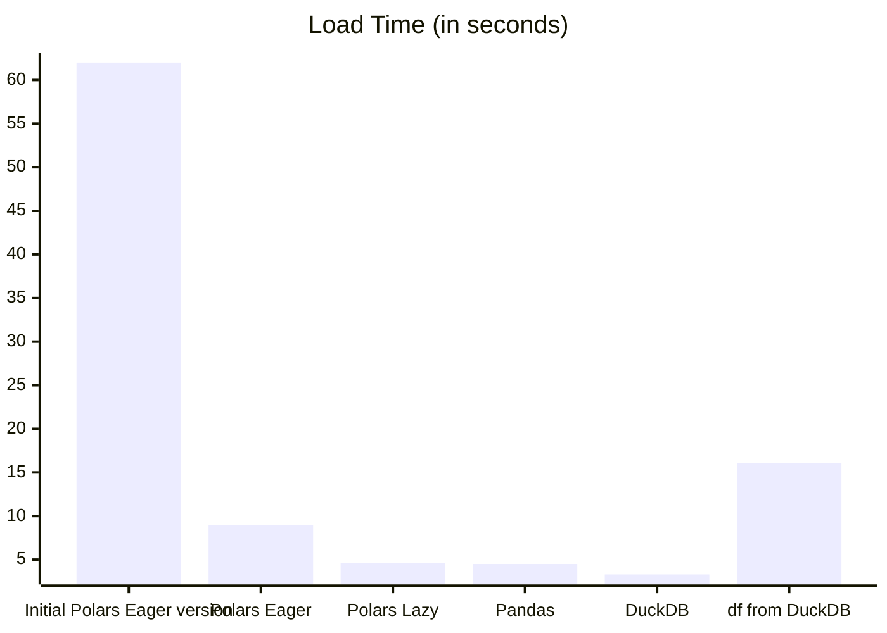
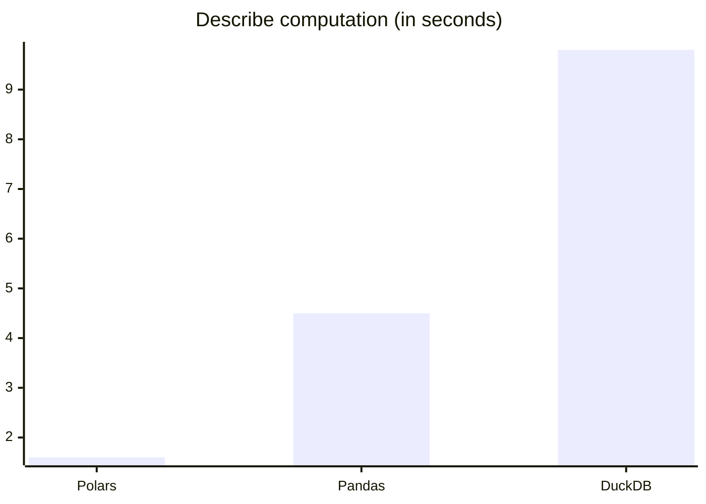
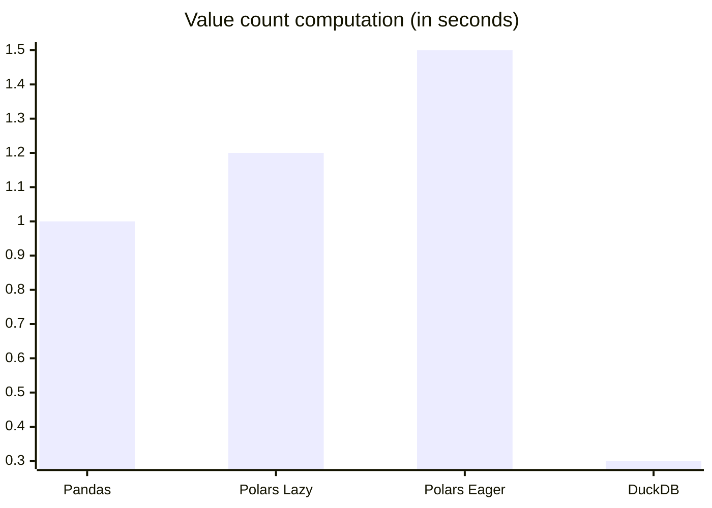
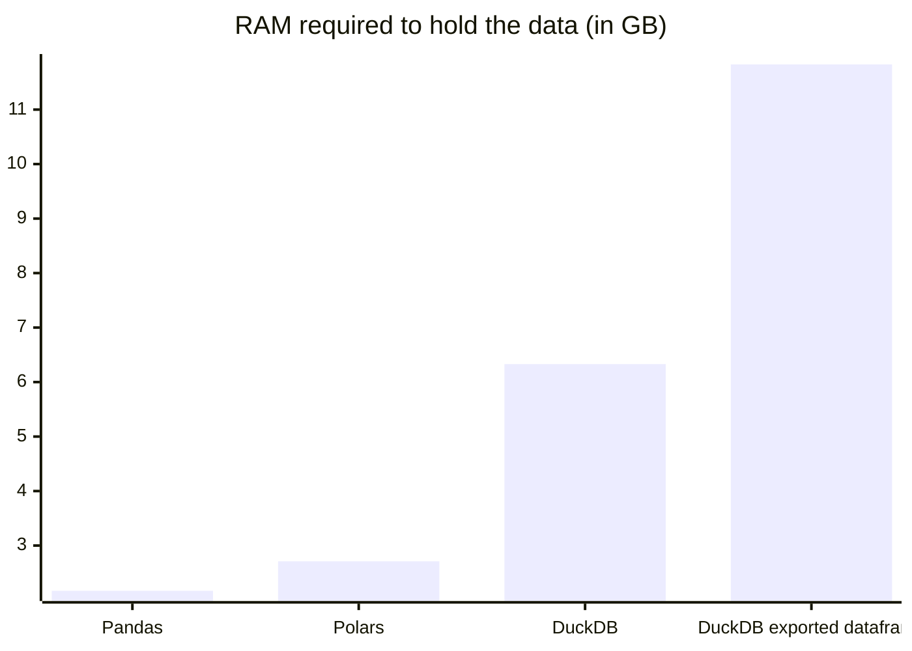

Storing structured sensor data in Parquet format can significantly reduce both disk and memory usage, especially when using categorical encodings instead of raw strings.
I wanted to evaluate how different Python libraries compare in terms of **load speed**, **analysis performance**, and **memory usage** when working with **categorical columns**.
From experience, Polars usually performs best on numerical and plain string data, but things get more nuanced when working with proper categorical types.

In this post, I benchmark three popular tools:

- [Pandas](https://pandas.pydata.org)
- [Polars](https://pola.rs)
- [DuckDB](https://duckdb.org)

## 🎯 Motivation

Parquet is a widely adopted columnar storage format that works best with tabular data, such as what you'd find in Pandas/Polars DataFrames or relational databases.
It’s ideal for structured data, especially when categorical encodings are used.

However, performance can vary significantly across tools depending on:

- How categorical columns are handled
- Whether the engine uses lazy or eager execution
- The overhead of internal data conversions during load and computation

To explore these differences, I built a benchmark using real-world sensor logs from wearable devices, where categorical metadata (e.g., activity, sensor type, orientation) complements numerical data.

The script to generate this dataset is available in the *Code and Reproducibility* section.

### What Are Categorical Columns? And why use them?

Categorical columns are features that take on a finite number of distinct values.
They are often stored as strings in raw datasets (e.g., `"walking"`, `"running"`), but with categorical columns they are encoded as integers internally for efficiency.

In Parquet, categorical columns are encoded using dictionary encoding: the values are stored as integers, with a reference to a lookup table of the original strings.
This allows both compact storage and readable output.
Thus, when queried, the decoded string values are returned instead of the raw integers, preserving correctness (compared to numerical values).

Frameworks differ in how they represent and operate on categorical columns but using parquet you have a format compatible with multiple libraries (such as Pandas, Polars and DuckDB).

## 📦 Dataset: REALWORLD2016

This benchmark uses data from the [REALWORLD2016 dataset](https://www.uni-mannheim.de/dws/research/projects/activity-recognition/dataset/dataset-realworld/), which includes accelerometer, gyroscope, and magnetometer readings from 15 subjects performing various physical activities.

Each record contains:

- `x`, `y`, `z` acceleration values
- A `time` index
- `user` integer ID
- Categorical metadata:
  - `activity` (e.g., walking, jumping)
  - `orientation` (e.g., chest, thigh)
  - `sensor` (acc, gyr, mag)

I converted the original zipped CSV logs into columnar Parquet files using Pandas and PyArrow. Categorical columns were explicitly typed using Arrow's standard format, which is more interoperable than relying on Polars- or DuckDB-specific enum types.
Thus, the resulting files are compatible with Pandas, Polars, and DuckDB.

## 🧪 Benchmark Tasks

Each framework was evaluated on four tasks:

1. **Loading** all Parquet files
2. **Descriptive statistics**: computing metrics like min, max, and mean on numerical columns
3. **Grouped counts** over the `activity`, `orientation`, and `sensor` columns
4. **Memory usage**: measuring the minimum RAM required to fully load the dataset

## 📁 Code and Reproducibility

All scripts and benchmark notebooks are available here:

👉 [GitHub Repository](https://github.com/vroger11/parquet-categorical-benchmark)

To reproduce the benchmarks:

```bash
uv sync
uv run python download_extract_realworld.py   # generate the Parquet files
jupyter notebook load_data_benchmarks.ipynb   # run the benchmarks
```

I recommend opening the notebook to review the implementations, along with additional remarks and tips included in the cells.
If you have suggestions or improvements, feel free to contribute (via issue, pull request, or a comment on this post).

## 📈 Results Summary

### Load Time (Lower is Better)



The first implementation of polars loading took 1min and 2s which is the worst solution by far. This solution uses implicit concatenation which is usually the goto in Python to write performant code.  However, in this case, the explicit concatenation strategy (handled manually before passing to Polars) performed significantly better. This is an unusual Python case where deferring to the library’s internal logic (in this case, written in Rust) actually hurts performance.

Lazy Polars loading was as fast as Pandas, while DuckDB was slightly faster.
Retrieving the Pandas DataFrame from DuckDB was noticeably slow and should be avoided, as it's slower than loading the data directly with Pandas.

!!! note "Note"
    Normally, you should avoid calling `.collect()` on a lazy Polars frame without chaining any transformations.
    This benchmark does intentionally call `.collect()` to isolate and compare the performance of each tool on specific tasks.
    As a result, Polars' lazy engine may be slightly underutilized in this context.
    Same remark for DuckDB where you should pass `hive_partitioning = true` in your `read_parquet` to avoid pre-loading non required data.

### Describe + value_counts

Let’s now benchmark some **analytical operations**, starting with `describe()` on numerical columns using each library:



Since the dataframes are already loaded into memory, there's no opportunity for Polars to apply lazy optimizations.
Despite that, Polars is clearly the fastest for this task.

Next, let’s look at grouped value counts:



Surprisingly, the Pandas implementation of value_counts() outperforms the lazy Polars version (1.0s vs 1.2s).
DuckDB, in contrast, is significantly faster here.

!!! warning "Correction"
    In a previous version of this post, I reported an incorrect value for DuckDB.
    Thanks to [Éric Mauvière](https://www.linkedin.com/in/ericmauviere/) for pointing out the inconsistency.

### Memory Usage

Here we measure how many RAM is needed to hold the data into RAM. Don't forget libraries can use more RAM to create the representation of all dataset (which is clearly a problem for DuckDB).

Here we measure how much RAM is required to hold the dataset once fully loaded in memory.
Note that during the loading process, some libraries allocate additional temporary memory to build their internal representation (this memory is released afterward).
This construction overhead is particularly significant in the case of DuckDB.



Polars used approximately 25% more memory than Pandas in this test.
This overhead is expected due to its use of Arrow and internal caching mechanisms.

DuckDB, however, consumed nearly three times more memory than Pandas.
This is because categorical columns are internally represented as full VARCHAR strings rather than compact integer codes.

Exporting the dataset from DuckDB to a dataframe further increases memory usage.
This adds 11.83 GB on top of DuckDB's base 6.33 GB, for a total of roughly 18.16 GB required.

## 📋 Conclusion

Each tool has its strengths:

| Tool   | Pros                            | Cons                       |
| ------ | ------------------------------- | -------------------------- |
| Pandas | Simple API, fast loading        | Don't have lazy evaluation     |
| Polars | Fastest analysis (with lazy mode)         | Performance suffers if misused   |
| DuckDB | Competitive loading and SQL-like flexibility |  High memory usage on categorical columns |

Polars is impressive when used correctly, but I recommend it only if you're prepared to leverage its lazy execution model.
As for DuckDB, I suggest avoiding it for workloads with Arrow categorical columns for now, since they are stored as `VARCHAR`, which defeats the purpose of efficient categorical encoding.

---

*Thanks for reading. Feel free to open issues or contribute improvements in the repository or leave a comment on this post.*
