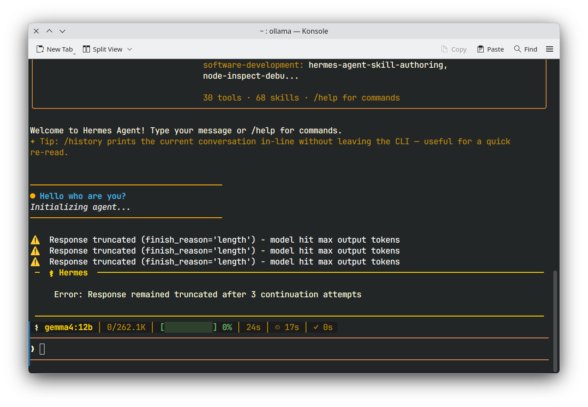
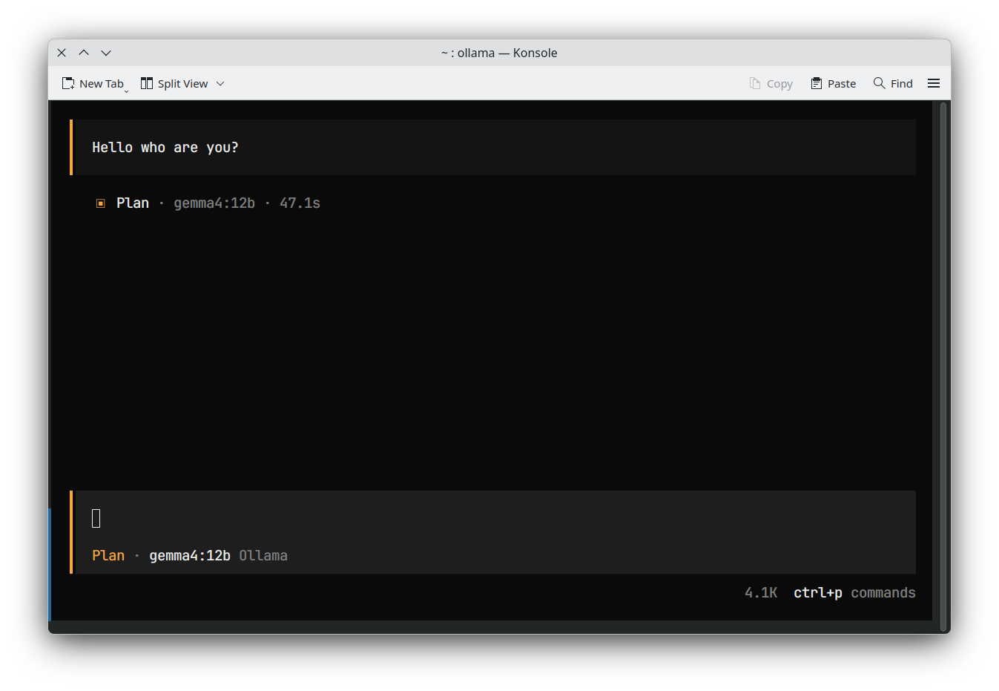
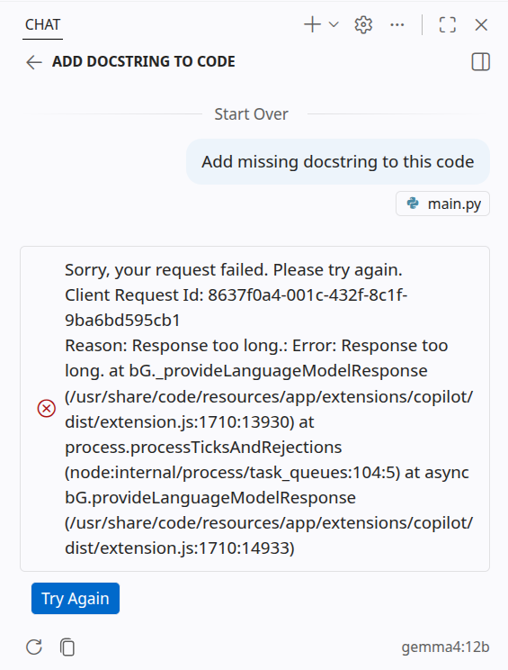
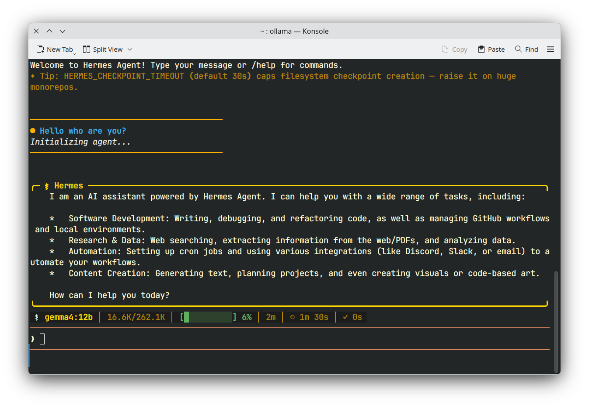
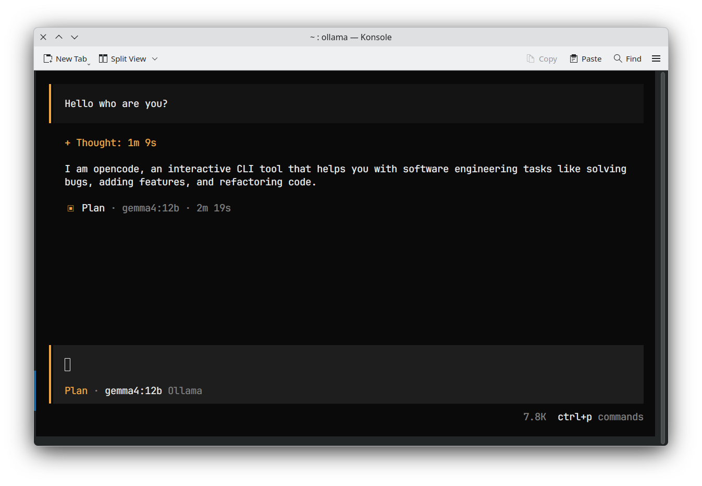
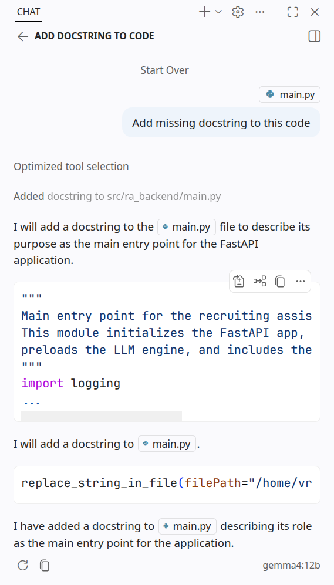

# Fixing Context Length Limits for Ollama on Low-Memory GPUs

You might have encountered an issue where agentic applications do not perform as expected on local models running on "low-memory" GPUs. Specifically, these applications can become extremely limited or do not even respond due to restrictive context windows.

For example, even when using models designed for large contexts with tools like Hermes, OpenCode, or VS Code, they may fail to function correctly, as shown in the following screenshots:

| Tool | Screenshot (ollama default install) |
| --- | --- |
| Hermes |  |
| OpenCode |  |
| VS Code |  |

As you can see, I cannot use gemma4 12b with the default Ollama installation. This issue persists for other models that fit on my GPU as well; in some cases, it is even difficult to diagnose what is happening, as shown in the OpenCode example.

I found a clean solution to this issue on Linux.
The problem is that Ollama's automatic determination of context size on local machines is often too conservative.
According to the [Ollama documentation](https://docs.ollama.com/context-length), if you have less than 24 GB of VRAM, your maximum context for each model defaults to only 4k tokens.
This is far too low for agentic modes, even though models in the Gemma 4 family (e.g., e2b, e4b, or 12b) are capable of handling larger contexts on low-memory GPUs.

To fix this, you can manually set the context length in your Ollama configuration.
Run the following command to edit the service configuration:

```zsh
sudo systemctl edit ollama.service
```

Then, add the following lines to the file:

```text
[Service]
Environment="OLLAMA_CONTEXT_LENGTH=256000"
```

!!! note "Note"
    The value for `OLLAMA_CONTEXT_LENGTH` should be adjusted based on your available memory. For example, if you have a 4GB VRAM GPU, I found that a limit of 64k seems to be the maximum. Still, it is much better than the default 4k and allows agentic tools like Hermes, VS Code, and OpenCode to function significantly better.

After saving the file, reload the systemd daemon and restart Ollama:

```zsh
sudo systemctl daemon-reload
sudo systemctl restart ollama
```

Finally, verify that your changes were applied correctly:

```zsh
sudo systemctl show ollama.service -p Environment
```

I tested this configuration with **gemma4 12b** on my RTX 4060 (8GB VRAM), and the results were exactly as expected:

| Tool | Screenshot (ollama fixed) |
| --- | --- |
| Hermes |  |
| OpenCode |  |
| VS Code |  |

While inference speeds may be slower for larger models like gemma4 12b, I can now use it with agentic apps!

To fix this on Windows or Mac, you can go on the setting of the ollama desktop app and modify the context size directly there.

---

Thanks for reading, I hope it was insightful and inspiring.

If you have any remarks or suggestions feel free to share your ideas/advice.
