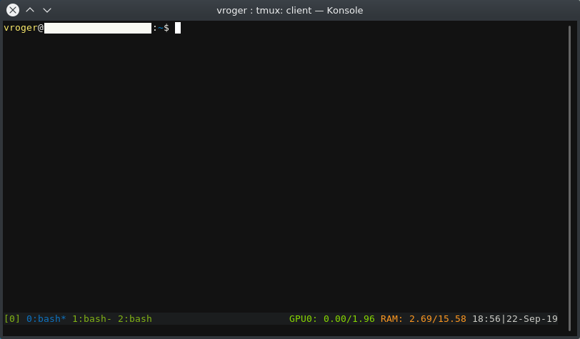

## Qu'est qu'un multiplexeur de terminaux?

Un multiplexeur de terminaux est un outil permettant d'avoir plusieurs sessions/fenêtres dans un seul terminal.
C'est utile pour partager un écran de terminal en plusieurs invités de commandes et/ou d'avoir une multitude d'invités de commandes accessibles à partir d'un seul terminal.
L'utilisation la plus intéressante est d'utiliser les multiplexeurs de terminaux sur un serveur/ordinateur distant pour réaliser des calculs (par exemple apprendre un modèle sur GPU).
En effet, à travers une connexion ssh vous ne pouvez pas vous déconnecter sans tuer le processus réalisant le calcul.
Tandis que le multiplexeur de terminaux permet de garder une session active même après déconnexion.
Il vous suffit de détacher la session du multiplexeur avant de vous déconnecter.
Après vous être reconnecté via ssh, il vous suffit de vous rattacher à la session effectuant votre calcul.

J'utilise énormément le multiplexeur de terminaux sur mes machines personnelles et sur des serveurs distants.
Cela me donne un environnement homogène sur l'ensemble des machines auxquelles j'ai accès.
Dans cet article de blogue, je vais parler du multiplexeur [Tmux](https://github.com/tmux/tmux/wiki).
Nous verrons comment l'installer, le configurer et l'utiliser.

## Tmux

J'utilise généralement une session de multiplexage simultanément.
Néanmoins l'utilisation de multiples sessions est possible avec la possibilité d'avoir un profil différent par session.
Pour plus de détails, je vous recommande de regarder le projet [tmuxp](https://tmuxp.readthedocs.io/en/latest/).
Dans cet article de blogue, je vais exclusivement me focaliser sur la configuration de Tmux et de son utilisation.

### Installation

#### Pour Ubuntu

```bash
sudo apt install tmux
```

#### Pour Fedora

```bash
sudo dnf install tmux
```

### Configuration

Toutes les configurations de tmux doivent être mises dans le fichier ~/.tmux.conf.
Dans cette partie, je vais détailler ma configuration et comment l'installer.
Elle peut être trouvée [ici](https://github.com/vroger11/vroger11-configs/tree/master/tmux).
Je mettrai à jour cette partie lorsque celle-ci évoluera.

Avant, observons le résultat attendu:

<figure markdown="span">
  
</figure>

Je n'ai pas énormément changé la configuration par défaut, on retrouve la barre de status en bas.
Cette dernière contient:

- la fenêtre courante en bleue (les autres sont en vert)
- en bas à droite se trouve l'utilisation globale en RAM CPU et GPU.

#### Installation

Mes fichiers de configuration sont composés en deux parties: des scripts bash pour récupérer des informations système et un fichier de configuration Tmux.
Pour installer ma configuration, vous devez télécharger [ces fichiers](https://github.com/vroger11/vroger11-configs/tree/master/tmux).
Ensuite il vous faut taper:

```bash
cp -r tmux_scripts ~/.tmux_scripts
cp tmux.conf ~/.tmux.conf
```

Mes scripts de récupération d'informations système sont les suivants:

- le script `gpu.sh` utilise la commande nvidia-smi (que vous devez installer quand vous installez vos pilotes graphiques) pour obtenir la quantité de RAM GPU utilisée.
  ce script prend l'id du GPU en paramètre (le premier ayant le numéro 0).
  À vous d'ajouter d'autres appels à ce script (dans l'option status-right du fichier tmux.conf) pour monitorer plusieurs GPUs.
  Si vous voulez améliorer ce comportement, n'hésitez pas à contribuer.
- le script `ram.sh` permet de récupérer l'utilisation de la RAM CPU par la machine.

Le fichier de configuration de tmux active l'intégration avec la souris (pour utiliser la molette, sélectionner l'invité de commande et redimensionner les fenêtres adjacentes)
Il modifie également certaines couleurs et les informations affichées dans la barre de status.
La barre de status est mise à jour toutes les 10 secondes.
Allez voir le livre [The Tao of tmux](https://leanpub.com/the-tao-of-tmux/read#status-bar) pour personnaliser votre tmux à vos besoins.

## Utilisation

Avant tout, démarrons une session.
Dans votre terminal (ou émulateur de terminal) tapez ceci:

```bash
tmux
```

Actuellement, les raccourcis par défaut combinés à la souris me conviennent.
Dans cet article, je mentionne uniquement les raccourcis que j'utilise couramment.
Pour utiliser les raccourcis de tmux, il vous faut tout d'abord appuyer sur la combinaison de touche `<Ctrl+b>` et ensuite taper un des raccourcis suivants:

- `"` pour partager la fenêtre courante horizontalement.
- `%` pour partager la fenêtre courante verticalement.
- `z` pour zoomer sur une des sous-fenêtres.
- `c` pour créer un nouvel onglet dans votre multiplexeur.
- `d` pour détacher votre session.

Je réalise toutes mes autres actions (sélectionner un onglet, redimensionner une fenêtre...) à l'aide de ma souris.
Pour rattacher tmux à la session précédente, il vous faut taper:

```bash
tmux attach-session
```

Si vous voulez connaitre d'autres raccourcis et savoir comment faire pour gérer plusieurs sessions, je vous recommande le livre [The Tao of tmux](https://leanpub.com/the-tao-of-tmux) et l'antisèche en suivant [ce lien](https://tmuxcheatsheet.com).

## Changement du comportement par défaut de partage d'écran

À chaque fois que je partageais un écran en deux, je me suis rendu compte que j'effectuais toujours les mêmes commandes `cd`.
Pour pallierr à ceci, j'ai ajouté les lignes suivantes dans mon fichier `tmux.conf`:

```bash
bind % split-window -h -c "#{pane_current_path}"
bind '"' split-window -v -c "#{pane_current_path}"
```

Maintenant les nouveaux écrans s'ouvrent dans le même répertoire que le terminal courant.

## Bonus: Alternative pour les utilisateurs de Gnome

Si vous voulez un environnement préconfiguré par défaut et que vous utilisez Gnome ainsi gnome-terminal, je vous recommande de regarder [Byobu](https://www.byobu.org/).
Leur site contient une vidéo explicative sur leur page d'accueil.
Les raccourcis de byobu ne fonctionnent pas avec tous les terminaux (ce qui ne me convient pas vu que j'utilise konsole).

## Sources

- [Tmux man page](https://man.openbsd.org/OpenBSD-current/man1/tmux.1)
- [The Tao of tmux](https://leanpub.com/the-tao-of-tmux)

J'espère que cela aidera certains d'entre vous.

À bientôt, Vincent.
