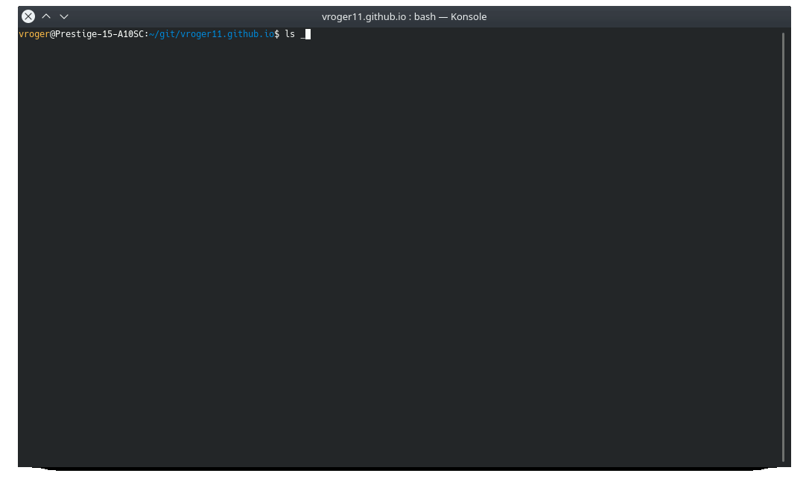

Cet article de blogue est focalisé sur la configuration de bash.
J'utilise bash, car c'est l'interpréteur de commandes par défaut dans la plupart des distributions Linux.
Je l'utilise quotidiennement et après quelques réglages il me convient mieux.
Dans cet article de blogue, je vais décrire mes habitudes et comment je configure mon bash.

## Utiliser le bashrc par défaut d'Ubuntu

La configuration par défaut d'Ubuntu est adaptée à l'usage quotidien et je me sers cette configuration comme base pour la mienne.
Avant faisons la revue de la configuration de base d'Ubuntu.

### Complétion par défaut

La complétion dans le terminal est essentielle pour gagner en productivité.
L'interpréteur de commandes par défaut d'Ubuntu est bash.
Sous cet interpréteur, la complétion s'active par l'appui de la touche tabulation.
Cette complétion est activée par défaut sur une multitude d'applications, comme la complétion de commandes (`apt ins<Tab>` donne `apt install `) ou de dossiers/fichiers.
Néanmoins, le comportement par défaut de complétion me semble non naturel.
Si vous appuyez de multiples fois sur la touche tabulation, vous finissez toujours avec la même liste de possibilités répétées le nombre de fois que vous appuyez sur la touche.
Comme dans l'exemple suivant:

<figure markdown="span">
  
</figure>

Dans la prochaine section nous verrons comment configurer bash pour qu'il soit plus consistent et utile.

### La recherche récursive

Pour accéder aux commandes précédemment écrites dans le terminal, vous pouvez utiliser la touche flèche vers le haut.
Si vous connaissez une partie de la commande que vous voulez réutiliser (et que cette commande n'a pas été écrite récemment) vous pouvez utiliser le mode récursif.
Pour entrer dans le mode récursif, vous devez taper les touches Ctrl+R et écrire les premières lettres de votre choix (`ssh` par exemple).
Le résultat est la première commande correspondant à votre recherche de votre historique bash.
Si vous voulez les résultats suivants issus de votre historique bash, vous avez juste à presser les touches Ctrl+R.
J'apprécie ce comportement, ainsi je le laisse tel quel.

### Les alertes

C'est un alias permettant d'envoyer des notifications sous Ubuntu.
Pour utiliser cet alias, il faut d'abord installer la librairie libnotify:

```bash
sudo apt install libnotify-bin
```

Cette commande envoie une notification à votre environnement de bureau lorsqu'elle est exécutée.
Je l'utilise souvent avec un et logique pendant que je fais du prototypage de modèles léger.
Voici un exemple que vous pouvez essayer chez vous pour mieux comprendre son utilité:

```bash
sleep 3 && alert
```

## Personnaliser votre bashrc

Avant de commencer, je vous conseille de faire une sauvegarde de votre bashrc.

```bash
cp ~/.bashrc ~/.bashrc_back
```

### Personnaliser l'invité de commandes

C'est la partie cosmétique, mais comme vous allez voir l'invité de commandes à chaque ligne que vous écrivez autant qu'il vous convienne.
Pour le personnaliser, il vous faut changer la variable PS1.
La mienne est comme suit:

```bash
PS1="\[\033[38;5;11m\]\u\[$(tput sgr0)\]\[\033[38;5;15m\]@\H:\[$(tput sgr0)\]\[\033[38;5;32m\]\w\[$(tput sgr0)\]\[\033[38;5;15m\]\\$ \[$(tput sgr0)\]"
```

Elle devrait se trouver sous la ligne suivante de votre fichier ~/.bashrc:

```bash
if [ "$color_prompt" = yes ]; then
```

Ainsi, remplacez la valeur par défaut par la vôtre.

Créer votre variable PS1 peut être long et fastidieux vu la syntaxe nécessaire.
Si vous êtes fainéant comme moi, servez-vous d'[ezprompt](https://ezprompt.net/) pour vous faciliter la vie.
C'est un site internet interactif pour vous aider à créer facilement votre variable PS1.

### Modifications de la variable PATH

J'aime mettre des scripts dans mon répertoire home (pour ne pas compromettre les répertoires de mon système d'exploitation).
Pour cela j'ai créé un répertoire bin dans mon répertoire home et j'ajoute la ligne suivante dans mon bashrc:

```bash
PATH=~/bin:$PATH
```

### Complétion

Comme vu dans la précédente section, le comportement par défaut de complétion n'est pas incroyable.
Par défaut, la touche tabulation est liée à la commande complete.
Heureusement, bash est livré avec une alternative: menu-complete.
menu-complete fait que la touche de tabulation, mais liste les suggestions sous forme de cycle.
Voici le même exemple que précédemment, mais utilisant menu-complete:

<figure markdown="span">
  
</figure>

Pour avoir ce comportement, vous devez ajouter les lignes suivantes dans votre fichier .bashrc:

```bash
# tab cycle through commands after listing
bind '"\t":menu-complete'
# completion results configuration
bind "set show-all-if-ambiguous on"
bind "set completion-ignore-case on"
bind "set menu-complete-display-prefix on"
# colored completion, for folders and others
bind 'set colored-stats on'
```

De plus, menu-complete permet d'aller dans le sens inverse du cycle de suggestion (dans le cas où vous avez sauté la suggestion désirée).
J'ai lié ce comportement à l'appui de la touche ² (car elle est au-dessus de la touche de tabulation d'un clavier AZERTY).
Pour cela il faut ajouter les lignes suivantes:

```bash
# reverse tab cycle
bind '"^[[Z":menu-complete-backward' # Shift+Tab, but it is not working in Konsole.
bind '"²":menu-complete-backward' # for azerty keyboard
```

## Mon fichier de configuration bashrc

Vous trouverez mon fichier bashrc [ici](https://github.com/vroger11/vroger11-configs/blob/master/bash/bashrc).
Il contient plus de personnalisation que présenté, comme la configuration d'environnement gem et l'initialisation de miniconda.
J'ai testé cette configuration sous l'émulateur de terminaux Konsole sous Ubuntu 18.04 (et KDE Neon) avec deux noms d'utilisateurs différents.
Néanmoins, soyez vigilants sur ce que vous faites avec ce script.
Je ne fournis aucune garantie.

## Sources

* [Les pages du manuel de Bash](https://linux.die.net/man/1/bash)

J’espère que cela aidera certains d’entre vous.

À bientôt, Vincent.
