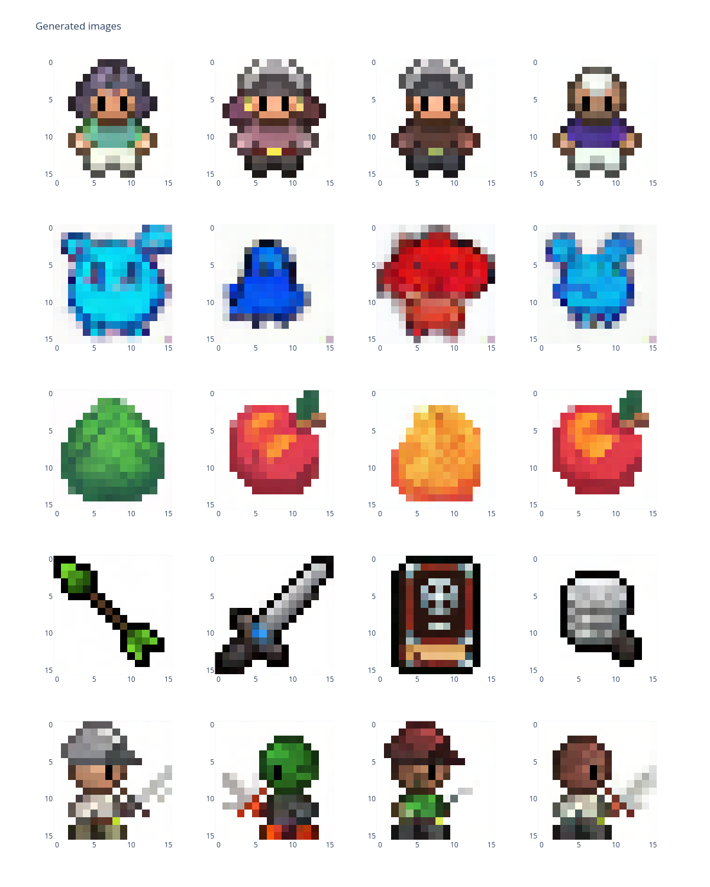

Suite à mon précédent billet sur la génération non conditionnelle à l'aide de la bibliothèque diffusers (lien [ici](06-02-diffusers-unconditional-model.md)), nous allons nous plonger dans la génération conditionnelle à l'aide de labels. Alors que de nombreux tutoriels et exemples se concentrent sur les modèles de diffusion guidés par le texte, dans cet article de blog, nous allons explorer l'utilisation de labels one-hot pour conditionner notre modèle de diffusion. Cette approche peut être particulièrement utile dans les scénarios où nous voulons générer des images basées sur des catégories discrètes plutôt que sur des descriptions textuelles.

## Diffusion conditionnelle

Les modèles de diffusion conditionnelle étendent la diffusion non conditionnelle en introduisant des informations supplémentaires au cours du processus de génération. Ces informations supplémentaires, ou données de conditionnement, peuvent guider le modèle pour qu'il produise des échantillons appartenant à une catégorie spécifique ou possédant certaines caractéristiques. Les entrées de conditionnement les plus courantes sont les descriptions textuelles, les labels de classe ou d'autres attributs d'image.

Dans ce tutoriel, nous utiliserons des labels [one-hot](https://fr.wikipedia.org/wiki/Encodage_one-hot) comme entrée de conditionnement. Le codage unitaire est une représentation des variables catégorielles sous forme de vecteurs binaires. Cette méthode est particulièrement adaptée à des tâches telles que la génération d'images, où chaque image correspond à une catégorie discrète. Si nous reprenons notre jeu de données précédent, nous aurons 5 catégories : `[héros, non-héros, nourriture, sort, héros de profil]`.

## Définir le modèle unet, le planificateur de bruit et le réseau pour intégrer nos labels

Par rapport à la dernière fois, nous utiliserons la classe `UNet2DConditionModel` pour notre modèle, et nous passerons la vérité terrain comme embeddings (espace latent).

```python
from diffusers import DDPMScheduler
from diffusers.models import UNet2DConditionModel

class_emb_size = 64

# Définir le modèle UNet
unet = UNet2DConditionModel(
    encoder_hid_dim=class_emb_size,                             # Taille de l'embeddings
    sample_size=(16, 16),                                       # Taille de l'image d'entrée
    in_channels=3,                                              # Nombre de canaux d'entrée (par exemple, 3 pour RVB)
    out_channels=3,                                             # Nombre de canaux de sortie
    layers_per_block=2,                                         # Couches par bloc dans l'UNet
    block_out_channels=(64, 128),                               # Canaux dans chaque bloc
    down_block_types=("DownBlock2D", "CrossAttnDownBlock2D"),   # Types de blocs descendants
    up_block_types=("CrossAttnUpBlock2D", "UpBlock2D"),         # Types de blocks ascendants
)

# Définir le planificateur DDPM
noise_scheduler = DDPMScheduler(num_train_timesteps=200)
```

Pour introduire des conditions avec un tel modèle, vous pouvez utiliser un bloc d'attention croisée, d'où l'utilisation de `"CrossAttnDownBlock2D"` et `"CrossAttnUpBlock2D"` dans notre `unet`.
Maintenant, nous avons besoin d'un réseau pour intégrer nos labels dans l'espace latent désirée, ici nous prendrons le même réseau que dans le cours de deeplearning.ai :

```python
class UnsqueezeLayer(nn.Module):
    """Couche générique pour appliquer unsqueeze à son entrée."""

    def __init__(self, dim: int) -> None:
        super(UnsqueezeLayer, self).__init__()
        self.dim = dim

    def forward(self, x: torch.Tensor) -> torch.Tensor:
        return torch.unsqueeze(x, dim=self.dim)


# We have to create this custom class to be able to use our sequential model inside our pipeline.
class CustomSequential(nn.Sequential):
    """Hérite de sequential pour ajouter les propriétés `device` et `dtype`.

    Cela suppose que tous les paramètres partagent le même `device` et utilisent le même type.
    """

    @property
    def device(self):
        return next(self.parameters()).device

    @property
    def dtype(self):
        return next(self.parameters()).dtype

num_classes = 5

emb_net = CustomSequential(
    nn.Linear(num_classes, class_emb_size),
    nn.GELU(),
    nn.Linear(class_emb_size, class_emb_size),
    UnsqueezeLayer(dim=1),
)
```

Ici, nous avons créé une classe basé sur `nn.Sequential` pour avoir les propriétés `device` et `dtype` sur ce modèle (pour pouvoir l'utiliser dans notre pipeline final). Comme `UNet2DConditionModel` est conçu pour avoir des text embeddings de forme `[batch, sequence_length, feature_dim]`, notre `emb_net` se termine avec un squeeze pour avoir l'embedding de forme `[batch_size, 1, class_emb_size]`. Le fait de ne pas avoir de séquence dans nos labels, cela convient mieux à notre cas.

## Entraîner le modèle

Ici, j'ai modifié notre fonction train pour ajouter une précision mixte (pour accélérer l'entraînement) et notre conditionnement :

```python
def train(
    unet: UNet2DConditionModel,
    emb_net: nn.Module,
    noise_scheduler: DDPMScheduler,
    dataloader: DataLoader,
    num_epochs: int,
    lr: float,
):
    epochs = range(num_epochs)

    optimizer = Adam(chain(unet.parameters(), emb_net.parameters()), lr=lr)
    scaler = GradScaler("cuda" if torch.cuda.is_available() else "cpu")  # For mixed precision
    unet.train()

    for epoch in epochs:
        epoch_loss = 0

        for batch in tqdm(dataloader):
            optimizer.zero_grad()

            # En supposant que votre dataloader fournisse les images et la cible associée
            images, labels = batch
            images = images.to(unet.device)
            labels = labels.to(dtype=torch.float32, device=unet.device)

            with autocast("cuda" if torch.cuda.is_available() else "cpu"):  # Mixed precision
                # Générer un bruit aléatoire
                noise = torch.randn(images.shape, device=unet.device)

                # Generate random timesteps and apply the noise scheduler
                timesteps = torch.randint(
                    0,
                    noise_scheduler.config.num_train_timesteps,
                    (images.shape[0],),
                    device=unet.device,
                )

                noisy_images = noise_scheduler.add_noise(images, noise, timesteps)

                # Compute the class embeddings
                enc_labels = emb_net(labels)

                # Forward pass through the model with labels embeddings
                predicted_noise = unet(
                    noisy_images, timesteps, enc_labels, class_labels=labels
                ).sample

                # Compute loss (mean squared error between actual and predicted noise)
                loss = torch.nn.functional.mse_loss(predicted_noise, noise)

            # Backward pass and optimization
            scaler.scale(loss).backward()
            scaler.step(optimizer)
            scaler.update()

            epoch_loss += loss.item()

        epoch_loss = epoch_loss / len(dataloader)
        print(f"Epoch {epoch + 1}/{num_epochs}, Loss: {epoch_loss}")
```

Il affiche la perte moyenne de chaque époque. Pour entraîner le modèle, nous faisons un forward sur des pas de temps aléatoires avec nos données et les embeddings (espace latent représentant les labels). Ensuite, nous calculons la perte sur le bruit prédit pour optimiser les paramètres de nos `unet` et `emb_net`. Dans le notebook, nous avons gardé le dataloader de deeplearning.ai, donc rien de nouveau sous le soleil. Comme vous pouvez le voir, notre boucle d'apprentissage n'est pas très différente de la boucle d'apprentissage de notre unet inconditionnel.

!!!info "Note"
    Je n'ai pas masqué aléatoirement les labels (comme dans le tutoriel de deeplearning.ai) car cela n'a pas amélioré les résultats. Mais nous verrons dans le prochain article pourquoi cela peut être important (dans les bonnes circonstances).

Maintenant, nous pouvons sauvegarder nos `unet` et `emb_net` pré-entraînés.

```python
unet.save_pretrained(pre_trained_unet_path)
torch.save(emb_net.state_dict(), pre_trained_emb_net_path)
```

## Faire des inférences avec l'unet entraîné

Maintenant que nous avons appris notre modèle, nous pouvons le charger et l'utiliser sur un pipeline de la bibliothèque diffusers.
Tout d'abord, chargeons nos modèles :

```python
unet = UNet2DConditionModel.from_pretrained(pre_trained_unet)
emb_net.load_state_dict(torch.load(pre_trained_emb_net))
```

Plutôt facile ! Maintenant la partie la plus difficile, nous devons créer un pipeline personnalisé pour utiliser nos modèles. Ici, nous ne partirons pas de zéro en étendant le `DDPMPipeline` :

```python
from diffusers import DDPMPipeline


class ConditionalDDPMPipeline(DDPMPipeline):
    def __init__(
        self, unet: UNet2DConditionModel, class_net: CustomSequential, scheduler: DDPMScheduler
    ) -> None:
        super().__init__(unet=unet, scheduler=scheduler)
        self.class_net = class_net
        # to let the pipeline change the model device and/or type
        self.register_modules(class_net=class_net)

    @torch.no_grad()
    def __call__(
        self,
        class_label: list[list[float]],
        generator: Optional[Union[torch.Generator, List[torch.Generator]]] = None,
        num_inference_steps: int = 1000,
        output_type: Optional[str] = "pil",
        return_dict: bool = True,
    ) -> Union[ImagePipelineOutput, Tuple]:
        r"""
        La fonction d'appel au pipeline pour la génération.

        Args :
            class_label (list[list[float]]) :
                liste de labels onne-hot. len(class_label) représente le nombre d'exemples à générer.
            generator (`torch.Generator`, *optionnel*) :
                Un [`torch.Generator`](https://pytorch.org/docs/stable/generated/torch.Generator.html) pour rendre la génération déterministe.
            num_inference_steps (`int`, *optionnel*, par défaut 1000) :
                Le nombre d'étapes de débruitage. Plus d'étapes de débruitage conduisent généralement à une image de meilleure qualité au détriment d'une inférence plus lente.
            output_type (`str`, *optionnel*, par défaut `"pil"`) :
                Le format de sortie de l'image générée. Choisissez entre `PIL.Image` et `np.array`.
            return_dict (`bool`, *optionnel*, par défaut `True`) :
                Retourne ou non un [`~pipelines.ImagePipelineOutput`] au lieu d'un simple tuple.

        Returns:
            [`~pipelines.ImagePipelineOutput`] ou `tuple` :
                Si `return_dict` est `True`, [`~pipelines.ImagePipelineOutput`] est retourné, sinon un `tuple` est retourné, où le premier élément est une liste avec les images générées.
        """
        batch_size = len(class_label)
        # Échantillon de bruit gaussien pour commencer la boucle
        if isinstance(self.unet.config.sample_size, int):
            image_shape = (
                batch_size,
                self.unet.config.in_channels,
                self.unet.config.sample_size,
                self.unet.config.sample_size,
            )
        else:
            image_shape = (batch_size, self.unet.config.in_channels, *self.unet.config.sample_size)

        if self.device.type == "mps":
            # randn ne fonctionne pas de manière reproductible sur mps
            image = randn_tensor(image_shape, generator=generator)
            image = image.to(self.device)
        else:
            image = randn_tensor(image_shape, generator=generator, device=self.device)

        labels = torch.tensor(class_label, device=self.device)
        enc_labels = self.class_net(labels)

        # définir les valeurs des étapes
        self.scheduler.set_timesteps(num_inference_steps)

        for t in self.progress_bar(self.scheduler.timesteps):
            # 1. prédire le bruit model_output
            model_output = self.unet(image, t, enc_labels, class_labels=labels, return_dict=False)[
                0
            ]

            # 2. calculer l'image précédente : x_t -> x_t-1
            image = self.scheduler.step(model_output, t, image, generator=generator).prev_sample

        image = (image / 2 + 0.5).clamp(0, 1)
        image = image.cpu().permute(0, 2, 3, 1).numpy()
        if output_type == "pil":
            image = self.numpy_to_pil(image)

        if not return_dict:
            return (image,)

        return ImagePipelineOutput(images=image)
```

En résumé, c'est le même code que le `DDPMPipeline` de la librairie diffusers sauf que nous avons ajouté notre `emb_net` pour faire des générations conditionnées avec des labels.
Maintenant, déclarons notre pipeline avec cuda si possible, générons quelques échantillons et visualisons-les :

```python
pipeline = ConditionalDDPMPipeline(unet=unet, class_net=class_net, scheduler=noise_scheduler)
pipeline.to("cuda" if torch.cuda.is_available() else "cpu")

generated_image = pipeline(
    [
        # héros, non-héros, nourriture, sort, héros de profil
        [1.0, 0.0, 0.0, 0.0, 0.0],
        [1.0, 0.0, 0.0, 0.0, 0.0],
        [1.0, 0.0, 0.0, 0.0, 0.0],
        [1.0, 0.0, 0.0, 0.0, 0.0],
        [0.0, 1.0, 0.0, 0.0, 0.0],
        [0.0, 1.0, 0.0, 0.0, 0.0],
        [0.0, 1.0, 0.0, 0.0, 0.0],
        [0.0, 1.0, 0.0, 0.0, 0.0],
        [0.0, 0.0, 1.0, 0.0, 0.0],
        [0.0, 0.0, 1.0, 0.0, 0.0],
        [0.0, 0.0, 1.0, 0.0, 0.0],
        [0.0, 0.0, 1.0, 0.0, 0.0],
        [0.0, 0.0, 0.0, 1.0, 0.0],
        [0.0, 0.0, 0.0, 1.0, 0.0],
        [0.0, 0.0, 0.0, 1.0, 0.0],
        [0.0, 0.0, 0.0, 1.0, 0.0],
        [0.0, 0.0, 0.0, 0.0, 1.0],
        [0.0, 0.0, 0.0, 0.0, 1.0],
        [0.0, 0.0, 0.0, 0.0, 1.0],
        [0.0, 0.0, 0.0, 0.0, 1.0],
    ],
    num_inference_steps=200,
)

fig = plot_generated_images(generated_image.images, 5, 4)
fig.show()
```



Et voilà, nous avons généré nos premiers exemples conditionnés en utilisant la librairie de diffusers avec des labels one-hot.
Le notebook complet et les poids d'entrainement sont disponibles [ici](https://github.com/vroger11/diffusers-tutorial).

J'espère que cela aidera et/ou inspirera certains d'entre vous.

Au plaisir de vous revoir, Vincent.
