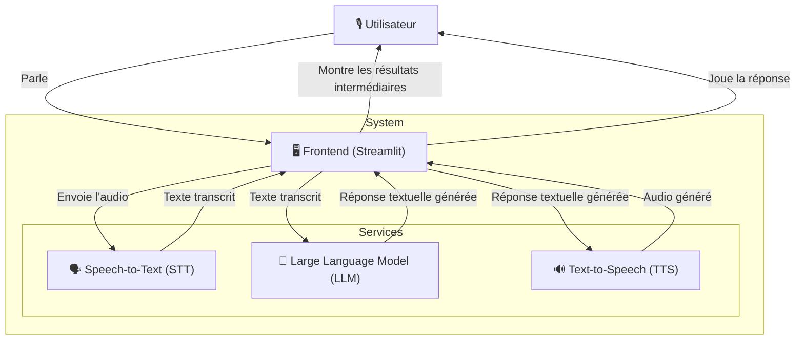

Ce post est le point de départ de ma nouvelle série de tutoriels sur la création d'un agent de parole à parole efficient.
Nous examinerons les choix faits et le type d'architecture choisi.
Dans ce post, nous nous concentrerons sur la version initiale disponnible sur [GitHub](https://github.com/vroger11/SpeechBot).
L'objectif est d'avoir une solution performante qui peut fonctionner sur une configuration de bureau moyenne (j'ai utilisé un AMD Ryzen 7 5700X, 32 Go de RAM et une NVIDIA RTX 4060).
Vous pouvez voir l'application en action sur [YouTube](https://youtu.be/5Cik2asxGfM) ou vous pouvez l'essayer sur votre machine.
Tous les modèles utilisés sont rassemblés sur Hugging Face Hub, et la solution est construite en utilisant plusieurs modèles au lieu d'un seul.

## **Architecture de SpeechBot**

SpeechBot est conçu comme un système modulaire où chaque composant gère une fonction spécifique dans le pipeline d'interaction vocale. Au lieu d'utiliser un modèle de parole à parole (où les modèles SOTA utilisent des milliards de paramètres et sont difficiles à améliorer), j'ai préféré utiliser cette solution car elle est simple à mettre en œuvre et simple à mettre à niveau.

De plus, créer un programme unique qui utilise et importe tous les modèles est difficile et peut être impossible car chaque modèle a ses exigences de dépendance qui peuvent être incompatibles.
Ainsi, j'ai opté pour créer un service par modèle, et un dernier pour le frontend, en utilisant FastAPI pour chaque service utilisant un modèle (STT, LLM, TTS).

Ainsi, l'architecture globale contient les composants suivants :

Les détails de chaque composant sont les suivants :

1. **Frontend (utilisant Streamlit)**
    - Capture la parole de l'utilisateur via un microphone.
    - Assure la communication entre les services.
        - Envoie l'audio enregistré au service Speech-to-Text (STT) pour obtenir la transcription.
        - Reçoit des réponses textuelles du service Large Language Model (LLM) étant donné la transcription.
        - Obtient la parole du service Text-to-Speech (TTS).
    - Joue la parole générée.
    - Montre à l'utilisateur le résultat de chaque étape.

2. **Service Speech-to-Text (STT)**
    - Convertit l'entrée parlée en texte.
    - Utilise un modèle (Whisper tiny) pour effectuer la transcription.

3. **Service Large Language Model (LLM)**
    - Traite le texte transcrit et génère une réponse.
    - Utilise un modèle pour comprendre le contexte (version distillée de Qwen 2.5) et générer des réponses ayant du sens.

4. **Service Text-to-Speech (TTS)**
    - Convertit le texte généré en parole.
    - Utilise un modèle pour synthétiser la voix de l'agent (tiny TTS-parler).

## Bibliothèques utilisées

Chaque service et le frontend sont dockerisés et peuvent être lancés en utilisant Docker Compose.
Alors que le frontend est écrit en utilisant Streamlit, chaque service est écrit comme une API REST (en utilisant FastAPI) avec des bibliothèques associées aux modèles sous le capot (llama-cpp ou transformers).
Voici les détails de pourquoi j'ai sélectionné ces bibliothèques :

### Streamlit

Streamlit est une libraire open-source qui vous permet de créer de belles applications web pour les projets de machine learning et de science des données avec un minimum d'effort. Il est utilisé pour le frontend pour capturer la parole de l'utilisateur, afficher les étapes intermédiaires et jouer la parole générée.

### FastAPI

FastAPI est une librarie web moderne, rapide (haute performance) pour la création d'API avec Python basé sur les annotations de type standard de Python. Il est utilisé pour créer des API REST pour chaque service (STT, LLM, TTS) en raison de sa rapidité et de sa facilité d'utilisation. De plus, la génération automatique de documentation Swagger et ReDoc (j'utilise Swagger pour tester mes services indépendamment) le rend adapté au développement rapide.

!!! warning "Avertissement"
    Cette application dans sa première version est conçue pour un seul utilisateur. La mise en œuvre des services FastAPI n'est pas écrite pour des utilisateurs concurrents.

### Docker Compose

Docker Compose est un outil pour définir et exécuter des applications multi-conteneurs Docker. Il est utilisé pour gérer les services et leurs dépendances, assurant une communication transparente entre tous les composants. En utilisant son sous-réseau, je peux facilement accéder aux services depuis le frontend (en utilisant des adresses comme `http://llm_service:8000`). Il simplifie également le déploiement et la gestion de tous les services.

!!! note "Note"
    Sur les serveurs cloud avec plusieurs clients, vous préférerez Terraform associé à Kubernetes au lieu de Docker Compose.

### Hugging Face Transformers

Hugging Face Transformers est une bibliothèque qui fournit des architectures à usage général pour la compréhension et la génération de langage naturel avec des modèles pré-entraînés. Elle est utilisée pour les services STT et TTS pour traiter le texte transcrit et générer des réponses.

### LlamaCpp

LlamaCpp est une bibliothèque qui fournit des implémentations efficaces de divers modèles LLM. Je la préfère à la bibliothèque transformers car elle offre de meilleures performances brutes.

## Modèles utilisés

Tous les modèles sont disponibles sur le [Hugging Face Hub](https://huggingface.co/), une ressource inestimable pour accéder à une large gamme de modèles et de jeux de données.

Pour le modèle STT, [Whisper tiny](https://huggingface.co/openai/whisper-tiny) a été sélectionné pour accomplir cette tâche car il obtient de bons résultats sur GPU et n'est pas gourmand en VRAM.

Pour le LLM, j'ai utilisé une [version distillée de Qwen 2.5](https://huggingface.co/bartowski/Qwen2.5.1-Coder-7B-Instruct-GGUF) pour être efficace sur CPU (car les modèles STT et TTS ne laissent pas assez de mémoire VRAM), car la performance était suffisante pour cette première version. Pour les futures versions, j'explorerai plus de modèles comme GEMINI de Google.

Pour le modèle TTS, j'ai sélectionné une version tiny de [tiny TTS-parler](https://huggingface.co/parler-tts/parler-tts-tiny-v1) pour s'assurer qu'il fonctionne efficacement sur les ressources disponibles.

!!! info "Besoin de vos retours"
    Si vous connaissez de meilleurs modèles que je pourrais utiliser, n'hésitez pas à me contacter pour que nous puissions en discuter. J'ai vu par la suite l'approche [speech-to-speech](https://github.com/huggingface/speech-to-speech) de Hugging Face qui a fait des choix similaires. Je prendrai leur approche en compte dans les futurs posts.

## Ce qui vient ensuite

Le prochain post de cette série portera sur la façon d'améliorer les performances, alors restez à l'écoute (vous pouvez suivre mon flux RSS ou me suivre sur [LinkedIn](https://www.linkedin.com/in/vroger11/)).
J'espère que vous avez apprécié, tout retour est le bienvenu.

À bientôt,

Vincent
