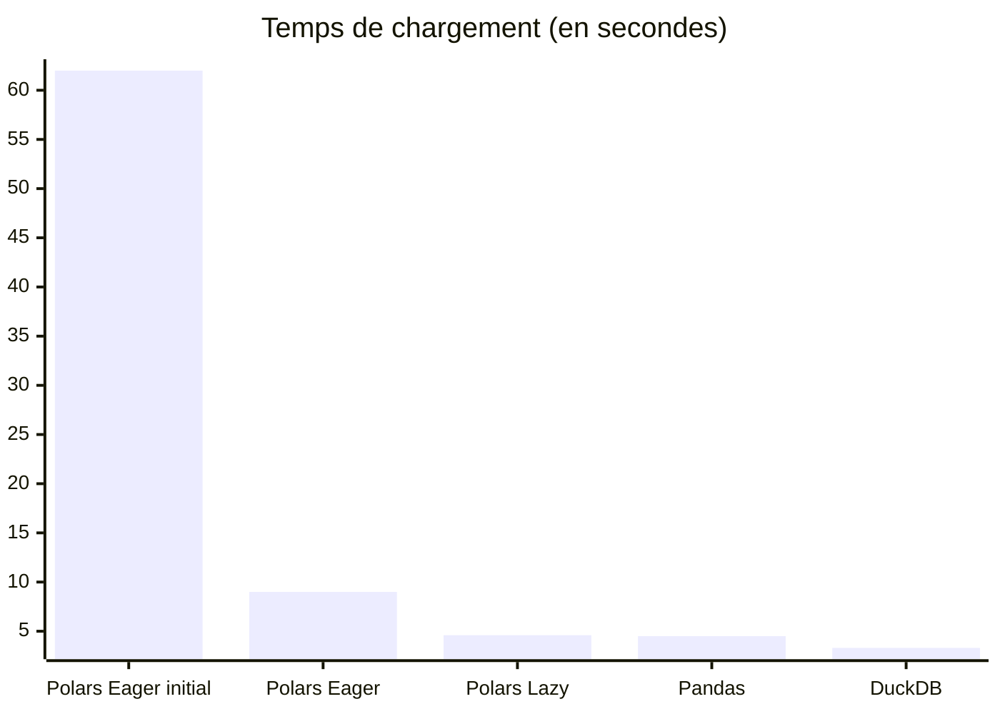
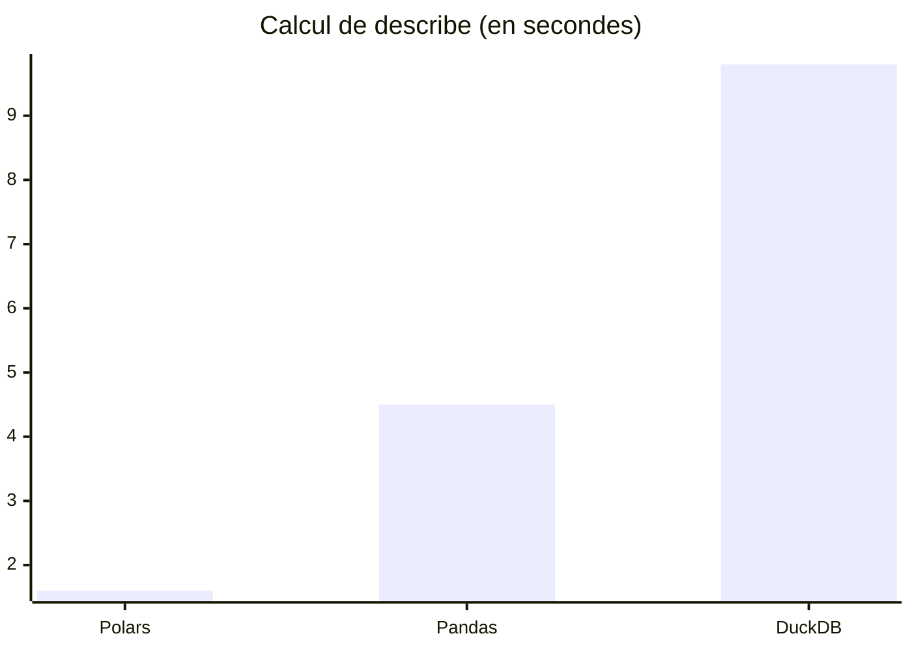
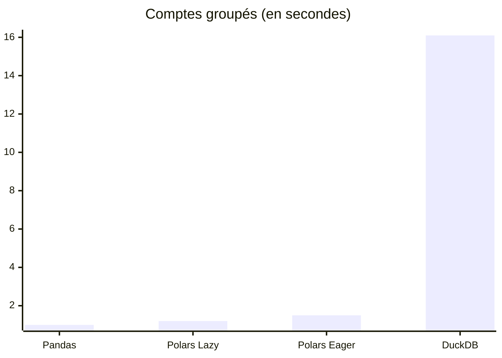
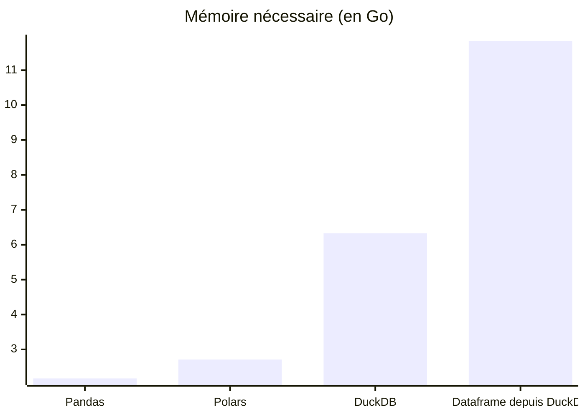

Stocker des données de capteurs structurées au format Parquet permet de réduire significativement l’espace disque et l’usage mémoire, en particulier lorsque l’on encode les colonnes catégorielles plutôt que d’utiliser des chaînes de caractères brutes.
Je voulais évaluer comment différentes bibliothèques Python se comparent en termes de **vitesse de chargement**, **performance analytique** et **utilisation mémoire** avec ce type de colonnes.

D’après mon expérience, Polars est souvent le plus rapide sur des données numériques ou de simples chaînes, mais le comportement change lorsqu’on utilise de véritables types catégoriels.

Dans ce billet, je compare trois outils populaires :

- [Pandas](https://pandas.pydata.org)
- [Polars](https://pola.rs)
- [DuckDB](https://duckdb.org)

## 🎯 Motivation

Parquet est un format de stockage en colonnes largement adopté, idéal pour des structures tabulaires comme celles des DataFrames (Pandas/Polars) ou des bases de données relationnelles.
Ce format est particulièrement efficace quand on encode les colonnes catégorielles.

Cependant, les performances varient fortement selon :

- La manière dont les colonnes catégorielles sont gérées
- L’usage d’une exécution paresseuse (lazy) ou immédiate (eager)
- Le coût des conversions internes pendant le chargement ou le calcul

Pour explorer ces différences, j’ai conçu un benchmark basé sur des journaux réels de capteurs portés, où des métadonnées catégorielles (activité, type de capteur, orientation) complètent les valeurs numériques.

Le script de génération du jeu de données est disponible dans la section *Code et reproductibilité*.

### Qu’est-ce qu’une colonne catégorielle et pourquoi les utiliser ?

Les colonnes catégorielles prennent un nombre fini de valeurs distinctes.
Elles sont souvent représentées sous forme de chaînes dans les jeux de données bruts (par exemple `"walking"`, `"running"`), mais peuvent être encodées en entiers pour plus d’efficacité.

Dans Parquet, cet encodage se fait via un dictionnaire : les valeurs sont stockées comme des entiers avec une table de correspondance pour retrouver la chaîne d’origine.
Cela permet un stockage compact tout en conservant la lisibilité lors des requêtes.

Chaque framework gère ces colonnes différemment, mais le format Parquet garantit une compatibilité entre bibliothèques comme Pandas, Polars et DuckDB.

## 📦 Jeu de données : REALWORLD2016

Ce benchmark utilise le [jeu de données REALWORLD2016](https://www.uni-mannheim.de/dws/research/projects/activity-recognition/dataset/dataset-realworld/) composé de mesures accéléromètre, gyroscope et magnétomètre sur 15 individus réalisant différentes activités.

Chaque enregistrement contient :

- Accélérations `x`, `y`, `z`
- Index temporel `time`
- ID utilisateur `user`
- Métadonnées catégorielles :
  - `activity` (ex : marche, saut)
  - `orientation` (ex : torse, cuisse)
  - `sensor` (acc, gyr, mag)

Les fichiers CSV compressés d’origine ont été convertis en fichiers Parquet avec Pandas et PyArrow, en forçant les colonnes catégorielles.
Les fichiers générés sont compatibles avec Pandas, Polars et DuckDB.

## 🧪 Tâches de benchmark

Chaque outil a été évalué sur quatre tâches :

1. **Chargement** des fichiers Parquet
2. **Statistiques descriptives** : min, max, moyenne sur les colonnes numériques
3. **Comptes groupés** sur les colonnes `activity`, `orientation` et `sensor`
4. **Utilisation mémoire** : RAM minimale nécessaire pour charger entièrement les données

## 📁 Code et reproductibilité

Tous les scripts et notebooks sont disponibles ici :

👉 [Dépôt GitHub](https://github.com/vroger11/parquet-categorical-benchmark)

Pour reproduire les benchmarks :

```bash
uv sync
uv run python download_extract_realworld.py   # génère les fichiers Parquet
jupyter notebook load_data_benchmarks.ipynb   # exécute les benchmarks
```

Je recommande d’ouvrir le notebook pour consulter les implémentations ainsi que les remarques et astuces ajoutées dans les cellules.
Vos suggestions et contributions sont les bienvenues (issues, pull requests ou commentaires).

## 📈 Résumé des résultats

### Temps de chargement



La première implémentation en eager de Polars, utilisant la concaténation implicite, est de loin la pire (62 s).
La concaténation explicite avant de passer les données à Polars s’est révélée bien plus performante.
C’est un cas rare où déléguer à la logique interne d’une bibliothèque nuit à la performance.

Polars en lazy est aussi rapide que Pandas, tandis que DuckDB est légèrement plus rapide encore.

!!! note "Note"
    En général, il faut éviter d'appeler `.collect()` sur un DataFrame lazy Polars sans chaîne d’opérations.
    Ici, `.collect()` est volontairement appelé pour isoler et comparer les performances entre outils.

### Describe + value_counts

On compare maintenant des opérations analytiques, à commencer par `describe()` :



Les données étant déjà en mémoire, Polars ne peut pas exploiter ses optimisations lazy.
Il reste tout de même le plus rapide.

Puis les comptes groupés (value_counts) :



Surprise : Pandas surpasse ici Polars Lazy (1.0 s contre 1.2 s).
DuckDB est bien plus lent.

Si vous connaissez une méthode plus efficace pour faire cela avec DuckDB, n’hésitez pas à contribuer !

### Utilisation mémoire

On mesure ici la RAM nécessaire pour contenir les données en mémoire.
Attention, certaines bibliothèques utilisent temporairement plus de mémoire pendant le chargement.



Polars utilise environ 25% de RAM en plus que Pandas, en raison d’Arrow et de son cache interne.

DuckDB consomme presque 3 fois plus que Pandas, car il stocke les colonnes catégorielles comme des chaînes complètes (VARCHAR).

Exporter le DataFrame depuis DuckDB aggrave la situation : on atteint 18.16 Go nécessaires.

## 📋 Conclusion

Chaque outil a ses points forts :

| Outil  | Avantages                        | Inconvénients                   |
| ------ | -------------------------------- | ------------------------------- |
| Pandas | API simple, chargement rapide    | Pas d’exécution lazy            |
| Polars | Analyse très rapide (en lazy)    | Moins performant si mal utilisé |
| DuckDB | Chargement compétitif, SQL natif | Grosse consommation mémoire     |

Polars est très efficace si bien utilisé, mais nécessite de connaître le lazy execution model.
DuckDB reste un bon outil SQL, mais à éviter pour les colonnes catégorielles, tant qu’elles sont représentées en VARCHAR.

---

*Merci pour la lecture. Vous pouvez ouvrir une issue, proposer une amélioration dans le dépôt, ou laisser un commentaire sur ce billet.*
