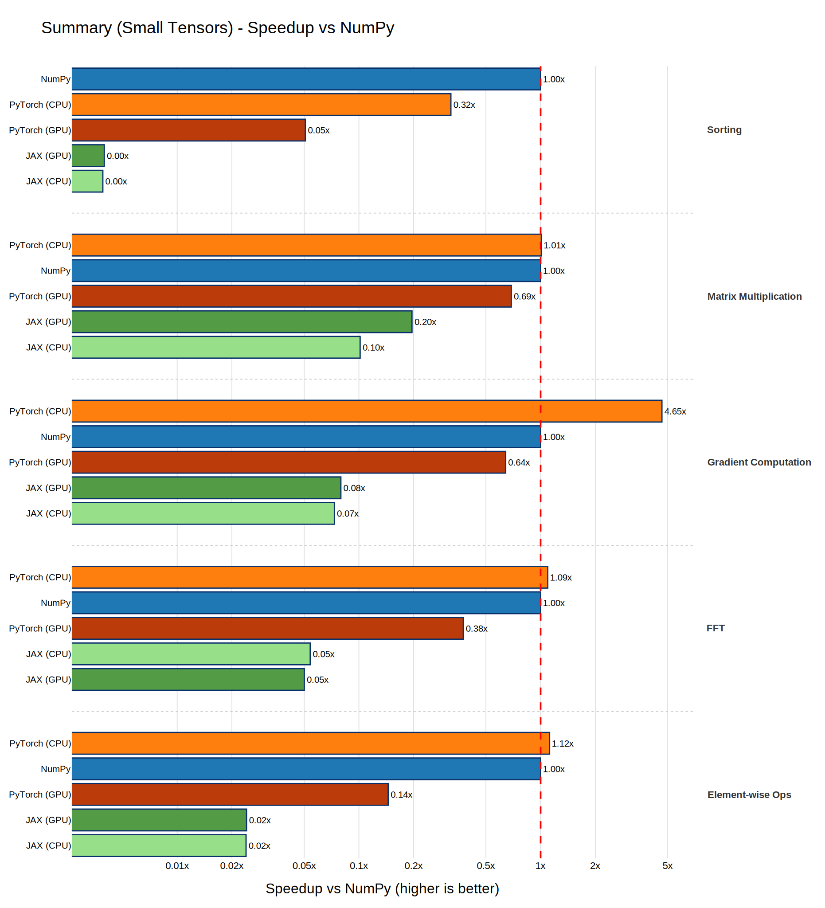
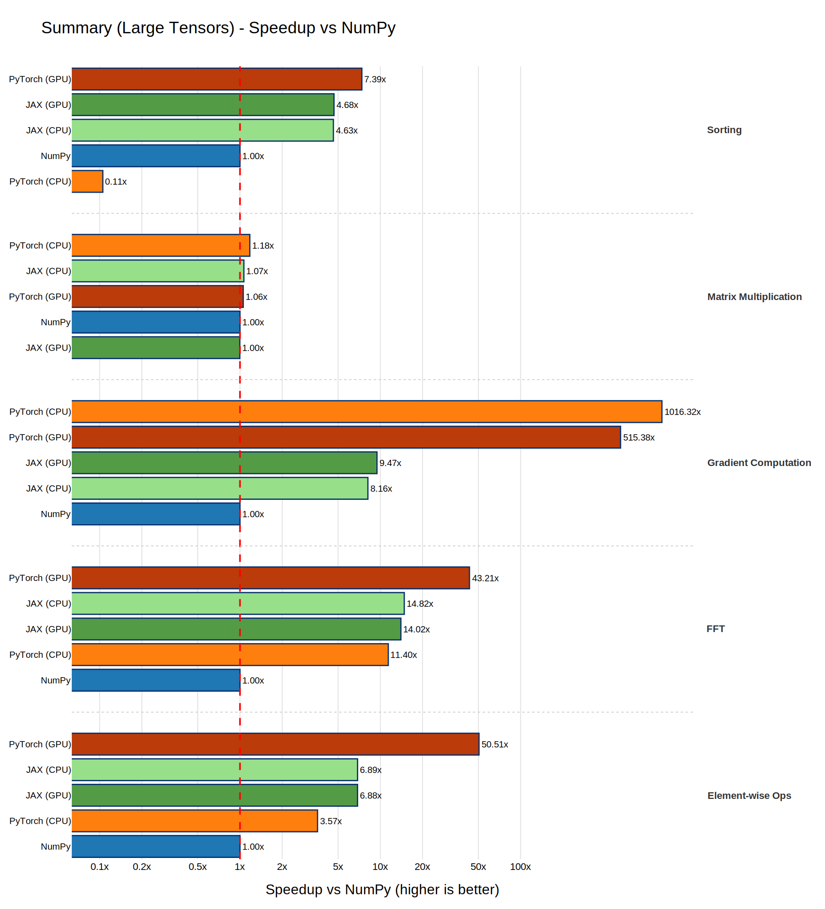

!!! note "Note"
    Cet article est une version traduite par IA. Si vous voulez voir le contenu original regardez la version anglaise.

# Benchmark NumPy vs JAX vs PyTorch

## Introduction

En calcul numerique avec Python, trois bibliotheques dominent le paysage : **NumPy**, **JAX** et **PyTorch**.
Chacune a ses propres forces.
NumPy est la bibliotheque fondamentale pour les tableaux, JAX apporte la differentiation automatique et la compilation XLA, et PyTorch propose un framework de deep learning flexible avec une execution en mode eager.

Mais comment se comparent-elles en termes de performances brutes sur des operations numeriques courantes ?
Cet article parcourt une suite de benchmarks qui oppose les trois bibliotheques sur CPU et GPU, a travers differents types d'operations et tailles de tenseurs.

## Materiel de test

Tous les benchmarks ont ete executes sur le systeme suivant :

| Composant | Specification |
|-----------|---------------|
| **GPU**   | NVIDIA GeForce RTX 4060 |
| **CPU**   | AMD Ryzen 7 5700X |
| **RAM**   | 32 Go DDR4 @ 3800 MT/s |

Les versions des bibliotheques utilisees au moment de la redaction etaient les suivantes :

| Bibliotheque | Version |
|-----------|---------------|
| JAX   | 0.9.2 avec CUDA 12 (le build CUDA 13 ne fonctionnait pas de mon cote) |
| PyTorch   | 2.10.0 avec CUDA 13 |
| NumPy   |  2.4.3 |

Toutes les bibliotheques ont ete installees via `uv`, donc toutes les optimisations n'etaient pas necessairement activees.
Mais comme la plupart des projets Python s'appuient desormais sur `uv`, cela represente le workflow habituel d'un developpeur Python.

Vous pouvez executer mon benchmark sur votre machine en utilisant le [code source](https://github.com/vroger11/python-numerical-libs-bench).

## Operations benchmarkees

La suite couvre cinq operations numeriques fondamentales, chacune testee a deux echelles : une **petite** taille de tenseur et une **grande** taille de tenseur.
Cela permet de reveler comment les caracteristiques d'overhead et de debit evoluent avec le volume de donnees.

### 1. Operations element par element

L'addition, la multiplication et le sinus element par element sont les operations de base du calcul sur tableaux.
Ces operations sont limitees par la bande passante memoire et testent l'efficacite avec laquelle chaque bibliotheque fait transiter les donnees a travers des kernels simples par element.

Pour ce test, la configuration etait la suivante :

- **Petit :** tableaux de taille 1 000
- **Grand :** tableaux de taille 1 000 000
- **Iterations :** 500 (petit), 100 (grand)

Pour chaque bibliotheque, le benchmark execute :

$$\text{result}_1 = a + b, \quad \text{result}_2 = a \times b, \quad \text{result}_3 = \sin(a)$$

A petite taille, l'overhead de dispatch domine. Le temps de lancement d'un kernel ou d'appel a une extension C compte plus que le calcul lui-meme. A grande taille, la bande passante memoire et la vectorisation prennent le dessus.

Cela est illustre dans les figures suivantes :

.svg)

.svg)

A petite echelle, PyTorch CPU et NumPy sont quasi a egalite (~4 ms pour 500 iterations), tandis que JAX subit un lourd overhead de dispatch (~170 ms) quel que soit le device.

A grande echelle, PyTorch GPU est le grand gagnant (0.021 s), environ 50x plus rapide que NumPy (1.07 s). JAX CPU et GPU se situent tous deux autour de 0.155 s sans difference notable entre les devices, suggerant que les tableaux ne sont pas assez grands pour que le chemin GPU de JAX surpasse son backend XLA sur CPU.

### 2. Multiplication matricielle

La multiplication matricielle est l'operation la plus importante en calcul scientifique et en deep learning. Elle est limitee par le calcul et beneficie enormement des bibliotheques BLAS optimisees et des tensor cores du GPU.

Pour ce test, la configuration etait la suivante :

- **Petit :** matrices $100 \times 100$
- **Grand :** matrices $2000 \times 2000$
- **Iterations :** 200 (petit), 50 (grand)

L'operation realisee dans ce test est :

$$C = A \cdot B, \quad A \in \mathbb{R}^{n \times n}, \; B \in \mathbb{R}^{n \times n}$$

C'est typiquement la ou l'acceleration GPU brille. Pour le cas $2000 \times 2000$, le calcul implique $2 \times 2000^3 = 16 \times 10^9$ operations en virgule flottante. Vous pouvez bien sur ajuster `main.py` si vous avez un meilleur GPU que le mien.

.svg)

.svg)

A petite echelle, NumPy et PyTorch CPU sont essentiellement a egalite (~5.7 ms), JAX etant en retrait a cause de l'overhead de dispatch.

Les resultats a grande echelle sont les plus surprenants de tout ce benchmark : les cinq configurations se situent dans un intervalle de 15 % (3.4 s a 4.0 s). PyTorch CPU est marginalement le plus rapide (3.42 s), tandis que NumPy et JAX GPU sont les plus lents (~4.0 s). Cela s'explique probablement par le fait qu'a 2000x2000 en float64, toutes les bibliotheques CPU finissent par appeler les memes routines BLAS sous-jacentes (OpenBLAS ou MKL), et le GPU n'a pas assez de travail pour compenser l'overhead de lancement des kernels. Si vous connaissez une raison plus profonde a cette convergence, n'hesitez pas a la partager.

### 3. Calcul de gradient

La differentiation automatique est ce qui distingue JAX et PyTorch de NumPy. Ce benchmark compare :

- **NumPy :** Gradient par differences finies numeriques (perturbation element par element)
- **JAX :** `jax.grad` avec autodiff en mode reverse
- **PyTorch :** `torch.autograd` via `.backward()`

!!! note "Note"
    NumPy n'a pas d'autodiff integre, donc nous utilisons les differences finies (une passe forward par parametre). C'est intentionnellement desavantageux pour mettre en evidence l'importance de l'autodiff analytique.

La fonction de cout utilisee pour ce test est :

$$\mathcal{L}(w, x) = \sum_{i} (w_i \cdot x_i)^2$$

et le benchmark mesure le temps de calcul de $\nabla_w \mathcal{L}$.

Pour ce test, la configuration etait la suivante :

- **Petit :** vecteurs de taille 100
- **Grand :** vecteurs de taille 10 000
- **Iterations :** 100 (petit), 20 (grand)

L'approche par differences finies de NumPy necessite $O(n)$ passes forward (une par parametre), ce qui la rend drastiquement plus lente a mesure que $n$ croit. JAX et PyTorch calculent le gradient complet en une seule passe backward avec un overhead $O(1)$ par rapport a la passe forward.

.svg)

.svg)

A petite echelle, PyTorch CPU est le plus rapide (6.6 ms), suivi de NumPy (30.8 ms) qui reste competitif malgre son approche en O(n). JAX subit de nouveau sa taxe de dispatch (~400 ms).

A grande echelle, le cout O(n) des differences finies devient devastateur : NumPy prend 2.16 s tandis que PyTorch CPU termine en 2.1 ms, soit un facteur **1000x**. PyTorch domine sur CPU comme sur GPU, JAX se situant entre les deux (~0.25 s).

### 4. Transformee de Fourier rapide (FFT)

La FFT est essentielle en traitement du signal, en simulations physiques et en methodes spectrales.
Sa complexite est en $O(n \log n)$ et elle sollicite un chemin de code tres different des routines d'algebre lineaire.

Pour ce test, la configuration etait la suivante :

- **Petit :** tableaux de taille 1 000
- **Grand :** tableaux de taille 1 000 000
- **Iterations :** 500 (petit), 50 (grand)

.svg)

.svg)

A petite echelle, PyTorch CPU et NumPy sont quasi identiques (~5.5 ms), battant tous deux JAX d'un facteur ~20x.

A grande echelle, PyTorch GPU prend la tete (0.040 s), suivi de JAX CPU et GPU (~0.12 s), puis PyTorch CPU (0.15 s). NumPy est le plus lent a 1.71 s, environ 43x plus lent que PyTorch GPU.

Je savais deja que PyTorch serait plus rapide que NumPy pour la FFT, meme sur CPU. J'en ai fait l'experience dans un precedent poste ou le passage des pipelines de traitement du signal de NumPy a PyTorch avait apporte des gains de performance significatifs.

### 5. Tri

Le tri est une operation basee sur les comparaisons, difficile a paralleliser efficacement.
Il teste un pattern algorithmique fondamentalement different des operations arithmetiques precedentes, car il repose sur des branchements et des acces memoire dependants des donnees.

Pour ce test, la configuration etait la suivante :

- **Petit :** tableaux de taille 1 000
- **Grand :** tableaux de taille 1 000 000
- **Iterations :** 200 (petit), 50 (grand)

.svg)

.svg)

A petite echelle, NumPy est le plus rapide (1.0 ms), suivi de PyTorch CPU (3.1 ms). JAX est de nouveau freine par l'overhead de dispatch (~250 ms).

A grande echelle, le tri revele une faiblesse majeure de PyTorch CPU : il prend 3.79 s, soit environ 9.5x plus lent que NumPy (0.40 s) et 70x plus lent que PyTorch GPU (0.054 s). JAX CPU et GPU s'en sortent tous deux bien (~0.086 s), suggerant que son tri compile par XLA est significativement plus efficace que l'implementation CPU de PyTorch. PyTorch GPU se reprend et prend la tete, confirmant que le goulot d'etranglement est specifique au chemin CPU de tri de PyTorch.

## Methodologie et pieges

Obtenir des benchmarks precis avec ces bibliotheques est plus difficile qu'il n'y parait.
Plusieurs subtilites peuvent produire des resultats tres trompeurs si elles ne sont pas correctement gerees.
Prenez mes resultats avec precaution et n'hesitez pas a contribuer si vous trouvez une erreur.
Voici ce que j'ai mis en place pour limiter les biais.

### Dispatch asynchrone

JAX et PyTorch (sur GPU) dispatched les operations de maniere **asynchrone**.
Quand on appelle `jnp.matmul(...)` ou `torch.matmul(...)`, la fonction retourne immediatement -- le calcul n'est pas encore termine.
Si on encapsule cela dans `timeit` naivement, on mesure le temps de *lancement* du kernel (microsecondes) au lieu du temps d'*execution* (millisecondes).

**Correction :**
- **JAX :** Appeler `.block_until_ready()` sur chaque resultat pour forcer l'execution synchrone.
- **PyTorch GPU :** Appeler `torch.cuda.synchronize()` apres chaque groupe d'operations.

### Transfert host-device dans la boucle de mesure

Une erreur frequente est de convertir les tableaux a l'interieur du lambda mesure :

```python
# MAUVAIS : mesure le transfert + le calcul
lambda: jnp.matmul(jnp.array(mat1), jnp.array(mat2))

# BON : mesure le calcul uniquement
jnp_mat1 = jnp.array(mat1)  # pre-alloue
jnp_mat2 = jnp.array(mat2)
lambda: jnp.matmul(jnp_mat1, jnp_mat2).block_until_ready()
```

Tous les tenseurs et tableaux sont pre-alloues sur le device cible avant le debut de la mesure, de sorte que les benchmarks mesurent le calcul pur.

### Accumulation des gradients

PyTorch accumule les gradients par defaut. Si on reutilise un tenseur avec `requires_grad=True` sur plusieurs appels `.backward()` sans remettre les gradients a zero, on obtient des valeurs incorrectes et une consommation memoire croissante. Le benchmark cree un nouveau tenseur a chaque iteration pour eviter ce probleme.

### Prechauffage JIT

JAX trace et compile les fonctions lors de leur premier appel via XLA. La premiere invocation est significativement plus lente que les suivantes. Le benchmark utilise suffisamment d'iterations (100-500 pour les petites tailles, 20-50 pour les grandes) pour que le cout de compilation soit amorti, bien qu'un appel de prechauffage dedie pourrait encore ameliorer la precision. Cela signifie que les resultats de JAX dans ce benchmark incluent une legere penalite d'overhead JIT, en particulier sur les benchmarks a faible nombre d'iterations.

## Synthese

### Petit vs. Grand : l'histoire de l'overhead

A petite taille, tout se joue sur l'**overhead** : cout d'appel des fonctions Python, latence de lancement des kernels, compilation JIT. NumPy, avec sa fine couche d'extension C, a souvent l'overhead le plus faible, et PyTorch CPU suit de pres. JAX paie une taxe de dispatch significative sur chaque benchmark a petite echelle.

A grande taille, la donne s'inverse en faveur du **debit** : largeur SIMD, bande passante memoire, parallelisme GPU. C'est la que le compilateur XLA de JAX et les kernels CUDA de PyTorch prennent l'avantage.

Voici un resume de la situation sur ma configuration :





## Lancer les benchmarks

La suite de benchmarks est empaquetee sous forme de module Python et peut etre lancee depuis la ligne de commande :

```bash
uv run main.py --output-dir benchmark_plots
```

Cela va :

1. Executer les cinq categories de benchmarks aux deux tailles de tenseurs (10 configurations au total).
2. Generer les graphiques de comparaison au format SVG dans le repertoire specifie.

Le flag `--output-dir` controle ou les graphiques sont sauvegardes (par defaut : `benchmark_plots/`).

## Conclusion

Aucune bibliotheque n'est universellement la plus rapide. Le bon choix depend de votre charge de travail. Malgre cela, j'utilise PyTorch par defaut sur nombre de mes projets.

!!! warning "Attention"
    Ce benchmark ne prend pas en compte l'accumulation d'operations asynchrones que PyTorch et JAX peuvent realiser.

Le point cle a retenir : **benchmarkez toujours sur votre propre charge de travail et votre propre materiel**, et ne vous attendez pas a ce que NumPy soit la meilleure solution, meme sur de petits tenseurs.

---

Merci d’avoir lu, j’espère que ce post t’a été utile et inspirant.

Si vous avez des remarques ou suggestions, n’hésite pas à partager tes idées ou conseils.
